https://www.youtube.com/watch?v=zZyKUeOR4Gg&list=PL3MmuxUbc_hIhxl5Ji8t4O6lPAOpHaCLR&index=10

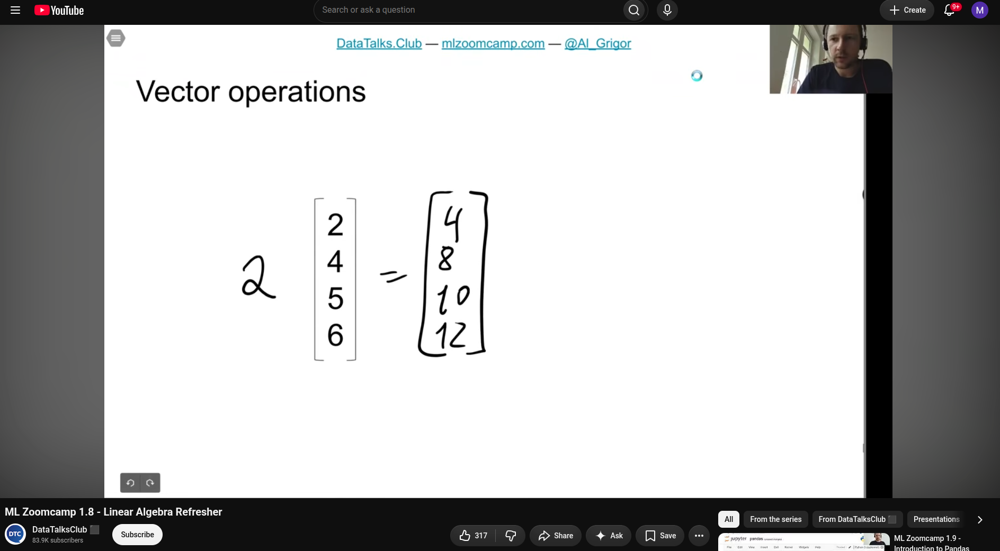 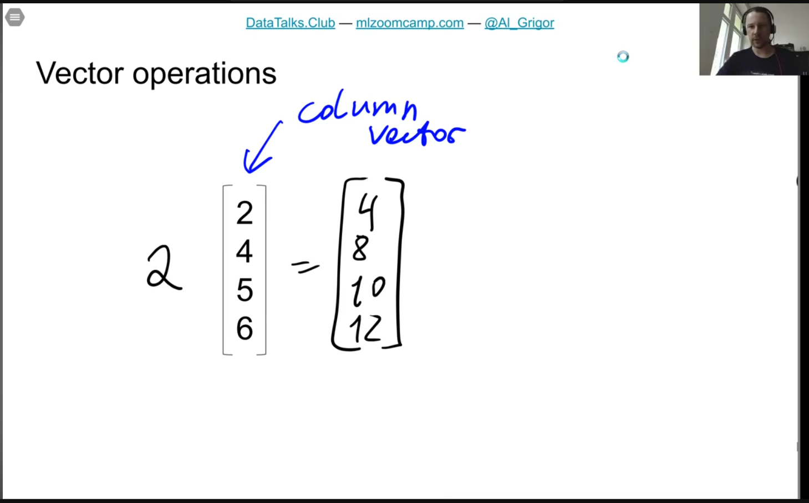 

 

- dot product produces a number
- 
- 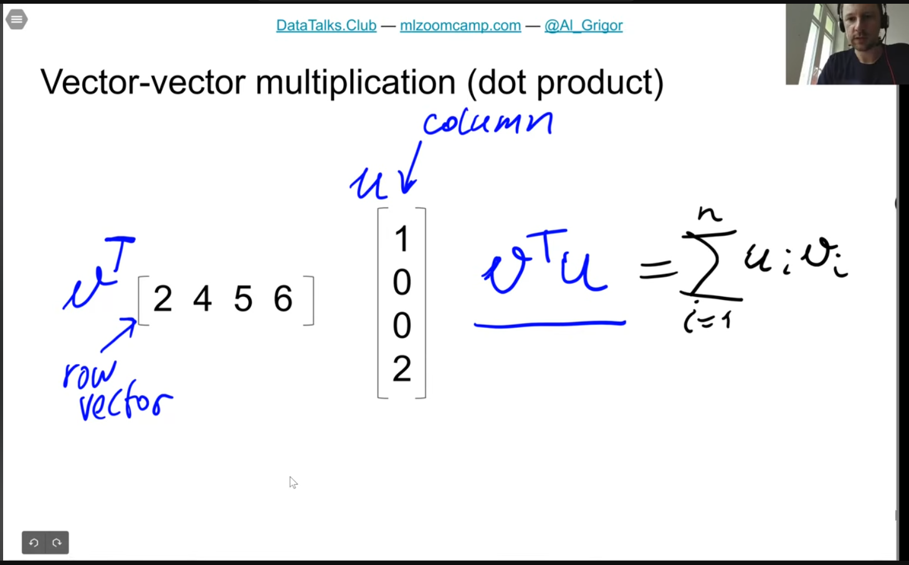
- 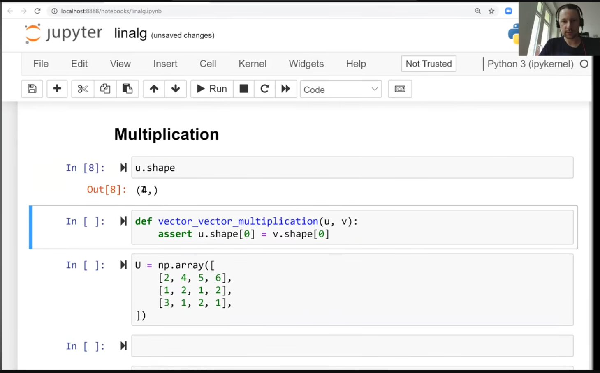
- 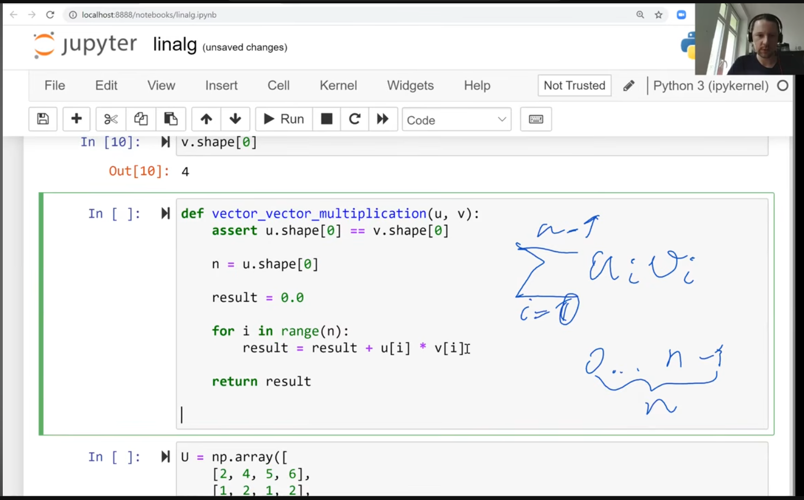 
- 
- matrix-vector -- you take each row in the matrix and multiply by the other vector
  - basically vector vector multiplication (dot-product)
- 
- 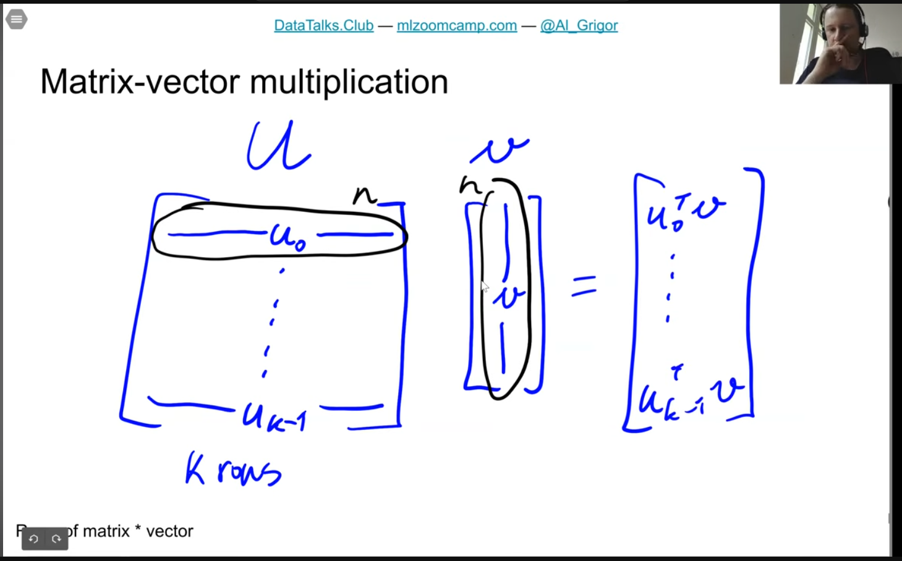
  - returns a vector with dot product in each row; same number of rows as the matrix
- 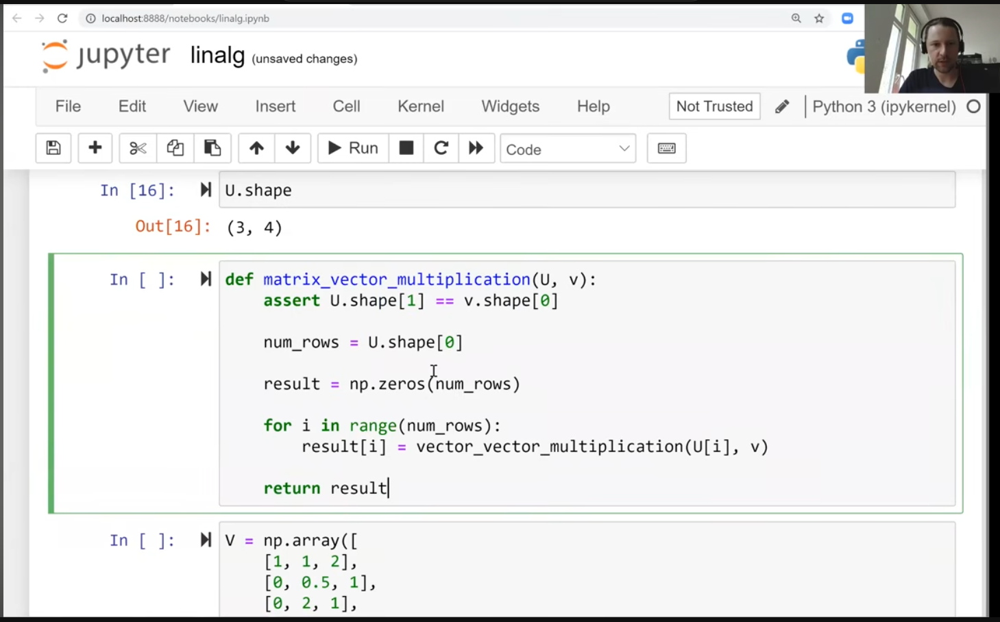
- 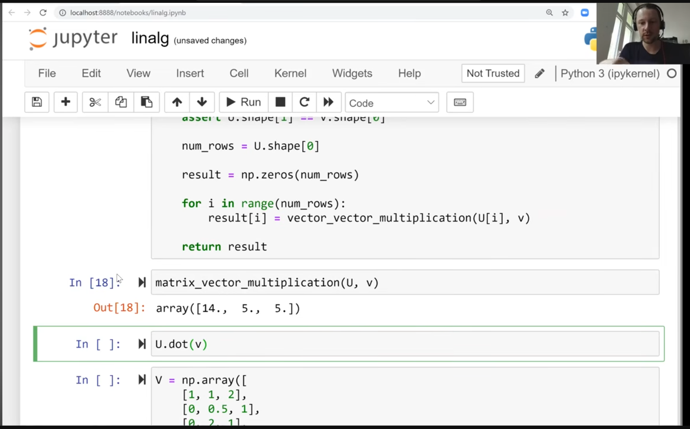
- 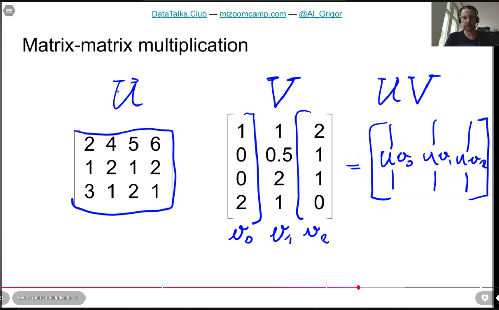
- 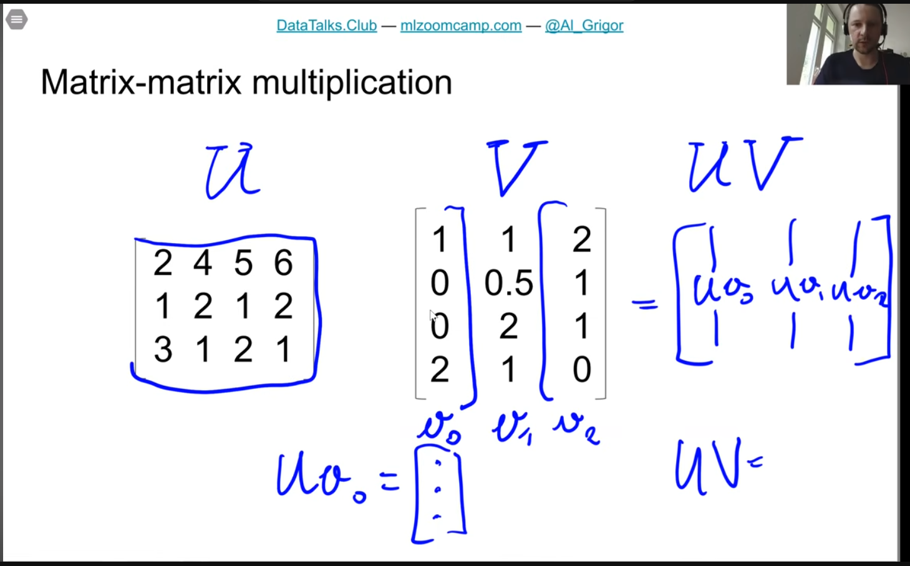
- 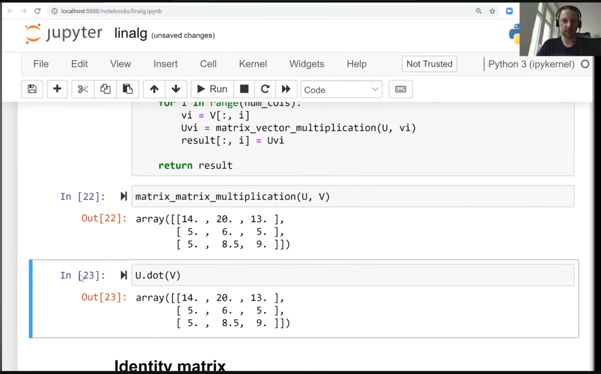
- identity matrix
- 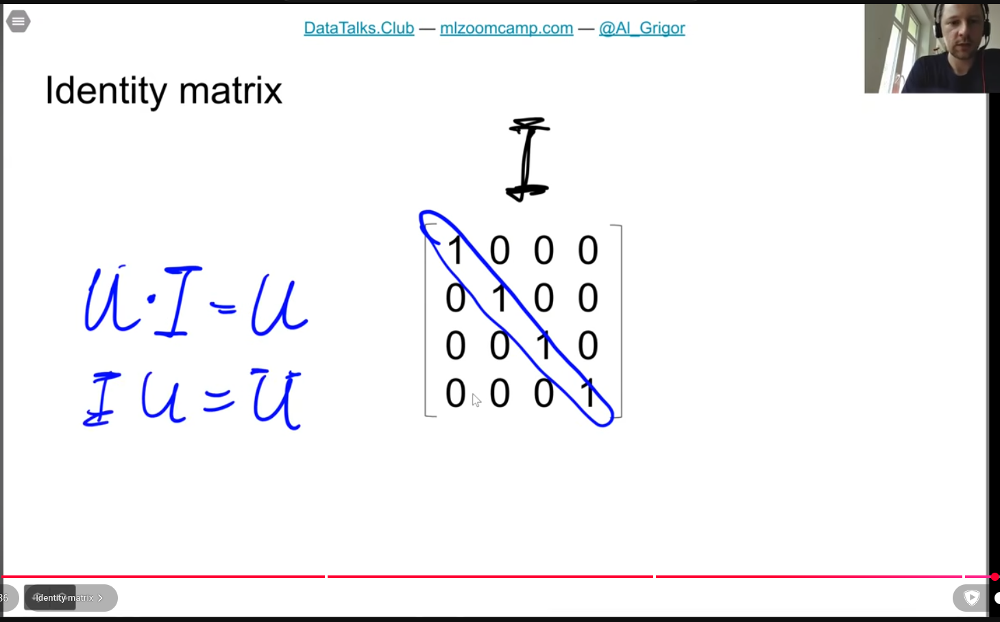
- 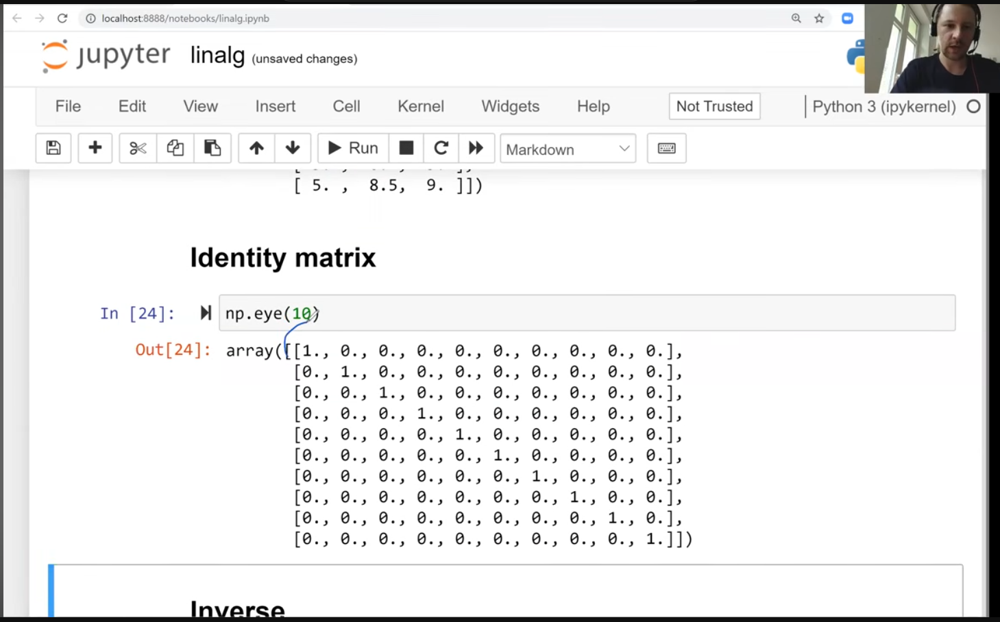
- 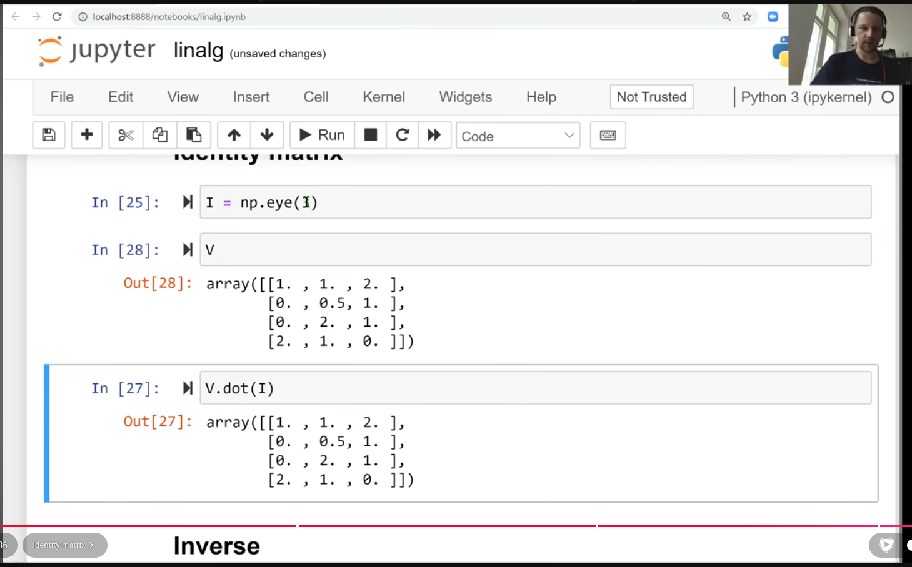
- 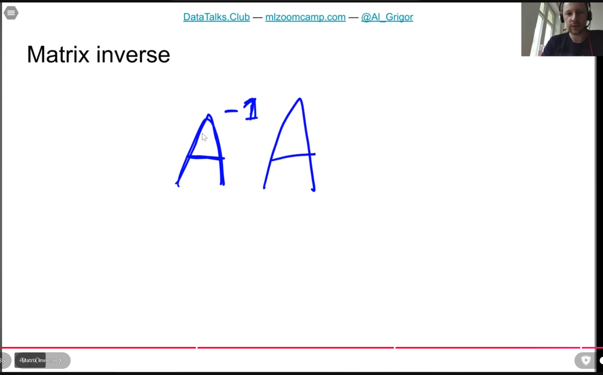
- Python

```
import numpy as np

# Matrix A: 3 rows, 4 columns
A = np.ones((3, 4))
# Vector v: 4 rows (4x1)
v = np.ones((4, 1))

# Matrix-vector product
res = np.matmul(A, v)

print("A shape:", A.shape)
print("v shape:", v.shape)
print("Result shape:", res.shape)

```

Code output

```
A shape: (3, 4)
v shape: (4, 1)
Result shape: (3, 1)

```

Matrix multiplication dimensions follow the standard rule:

  

$$(m \times n) \cdot (n \times p) = (m \times p)$$

For this operation:

  

-   Matrix dimensions: $3 \times 4$ ($3 \text{ rows} \times 4 \text{ columns}$)
    
      
    
-   Column vector dimensions: $4 \times 1$ ($4 \text{ rows} \times 1 \text{ column}$)
    
      
    

Since the inner dimensions match ($4 = 4$), the multiplication is valid, and the result is defined by the outer dimensions:

  

$$(3 \times 4) \cdot (4 \times 1) = 3 \times 1$$

Multiplying a $3 \times 4$ matrix by a $4 \times 1$ vector indeed yields a vector of **3 rows**.

- inverse -- only squar matrices have inverses
- 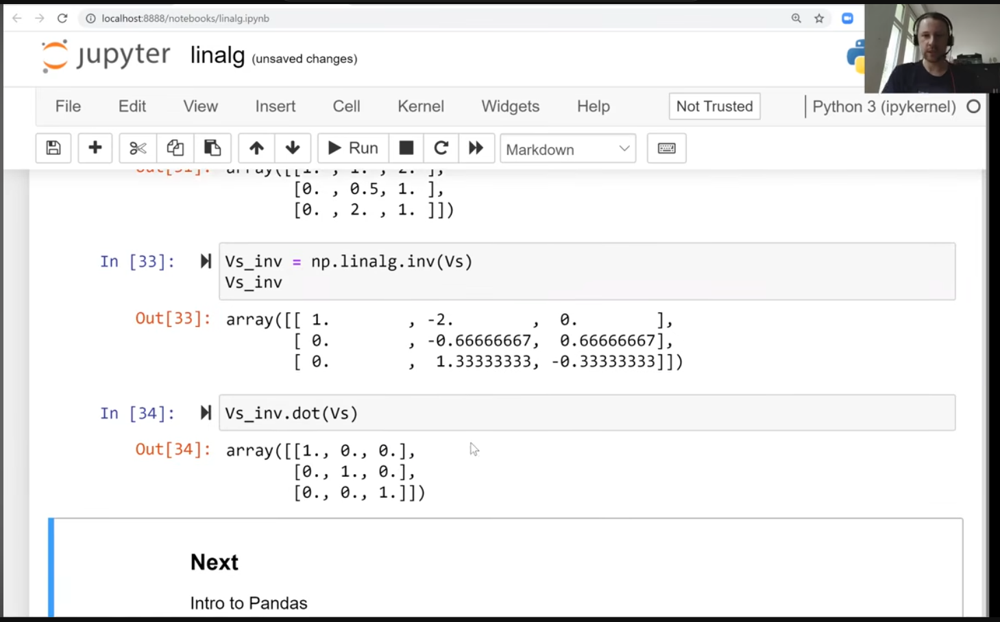 
- useful for linear regression!