-  
-  
-  
- 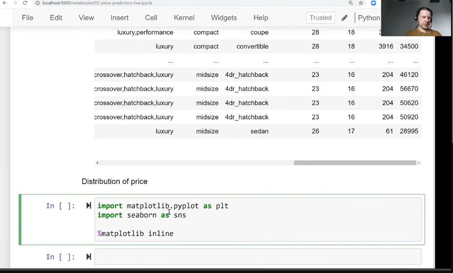 
- 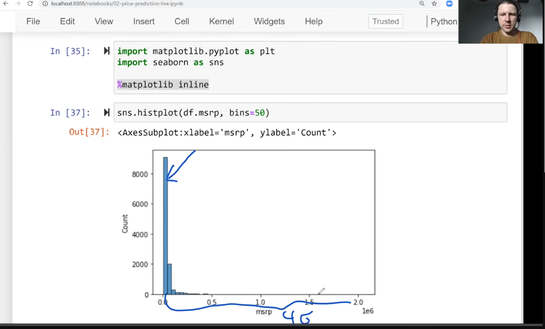 
- bins is how many bars actually have
- 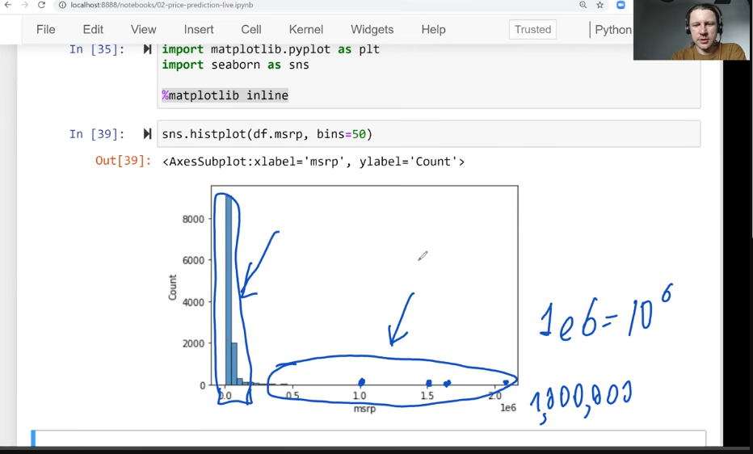
- long-tail distribution
- 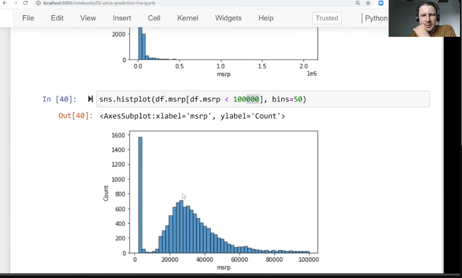
- long-tail very common for prices
- need to get rid of long tail using logrithm distro
- 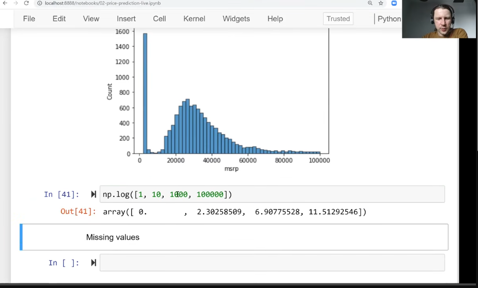
- 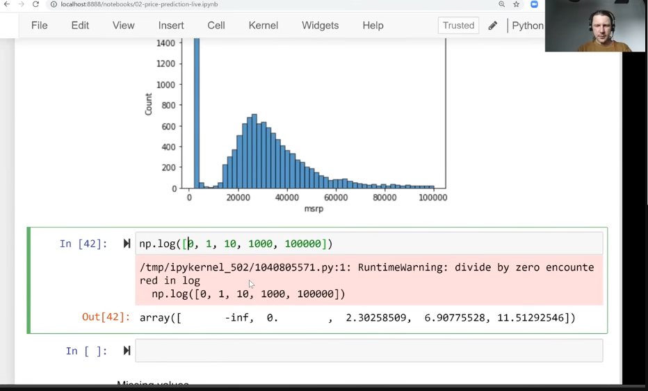
- 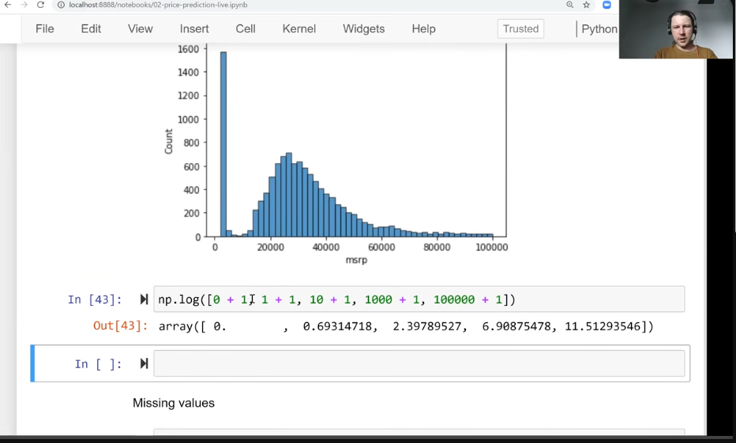
- 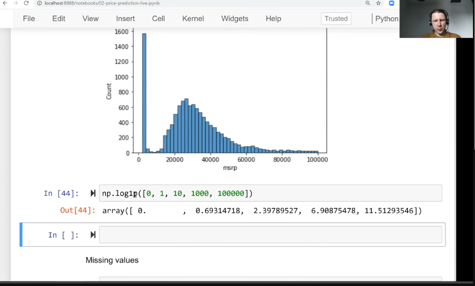
- 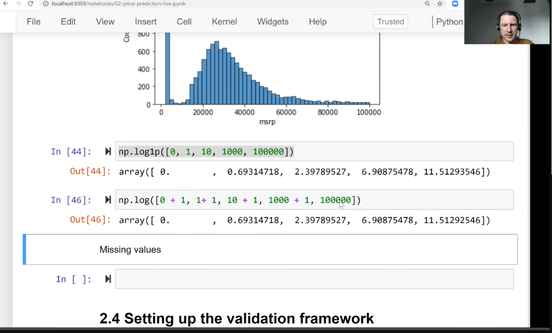
- 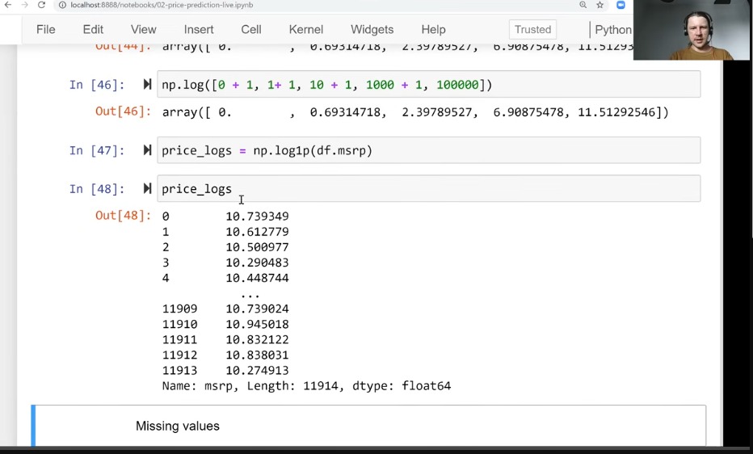
- 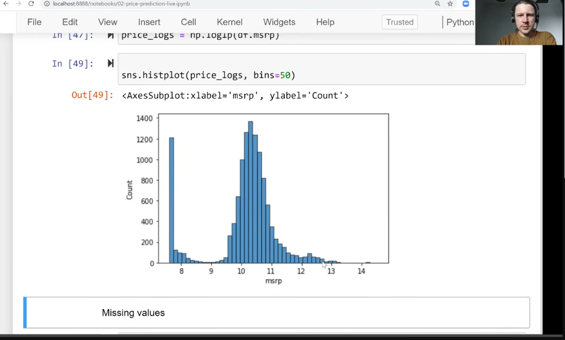
- 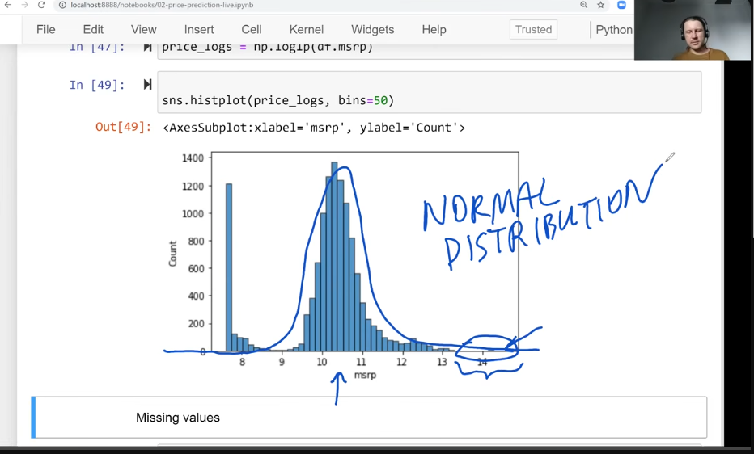
- some values are missing
- 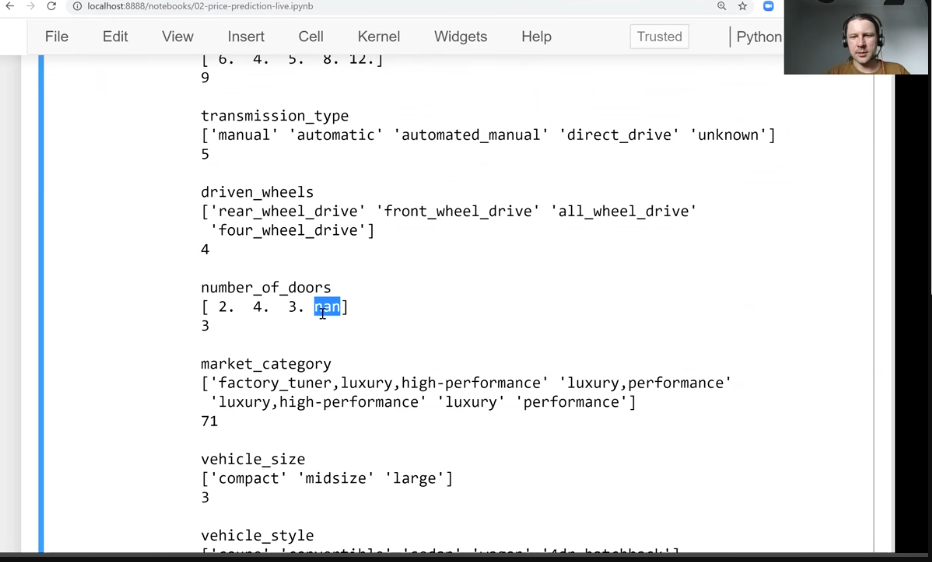
- 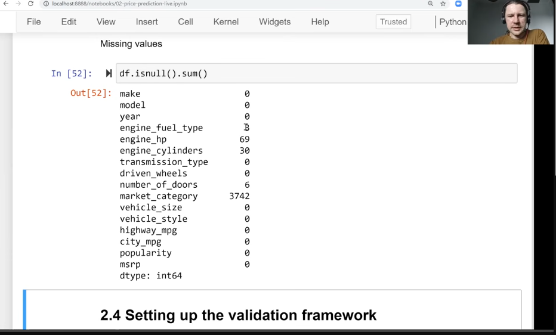
- 