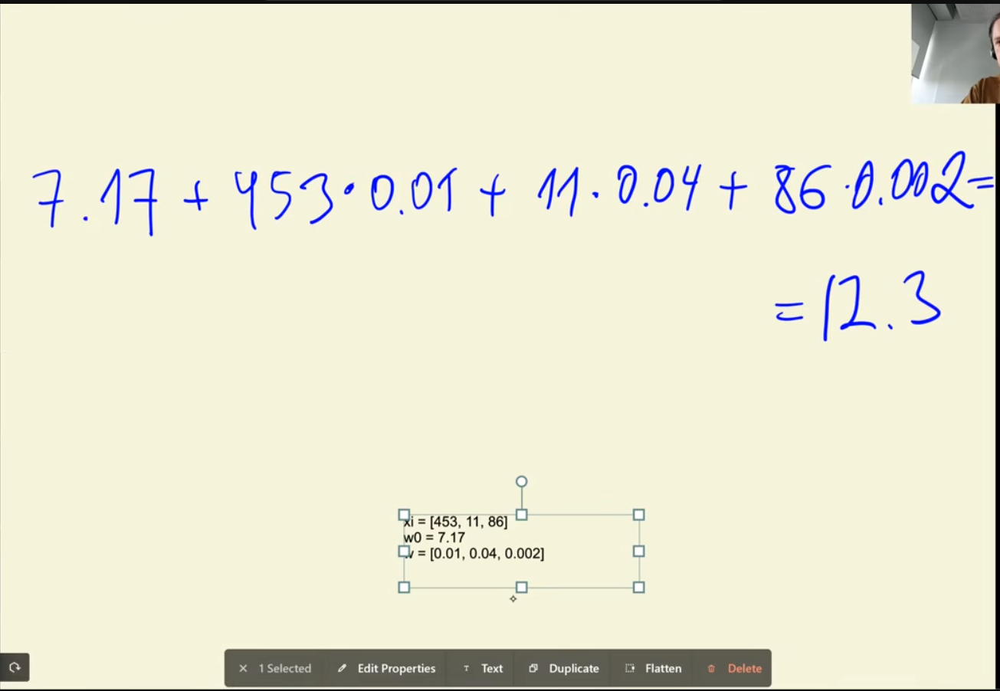
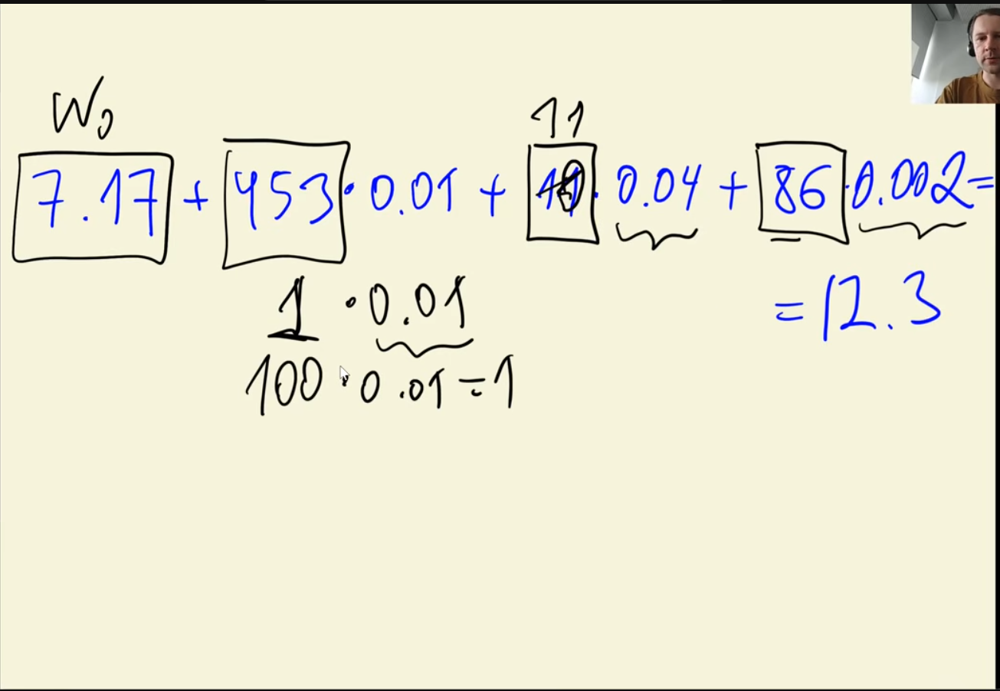
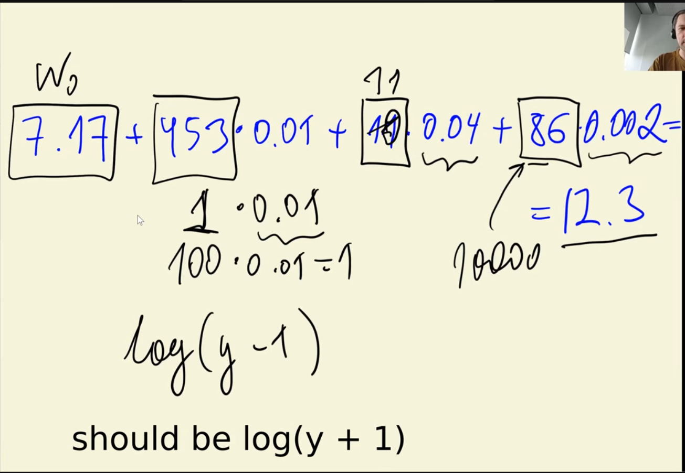
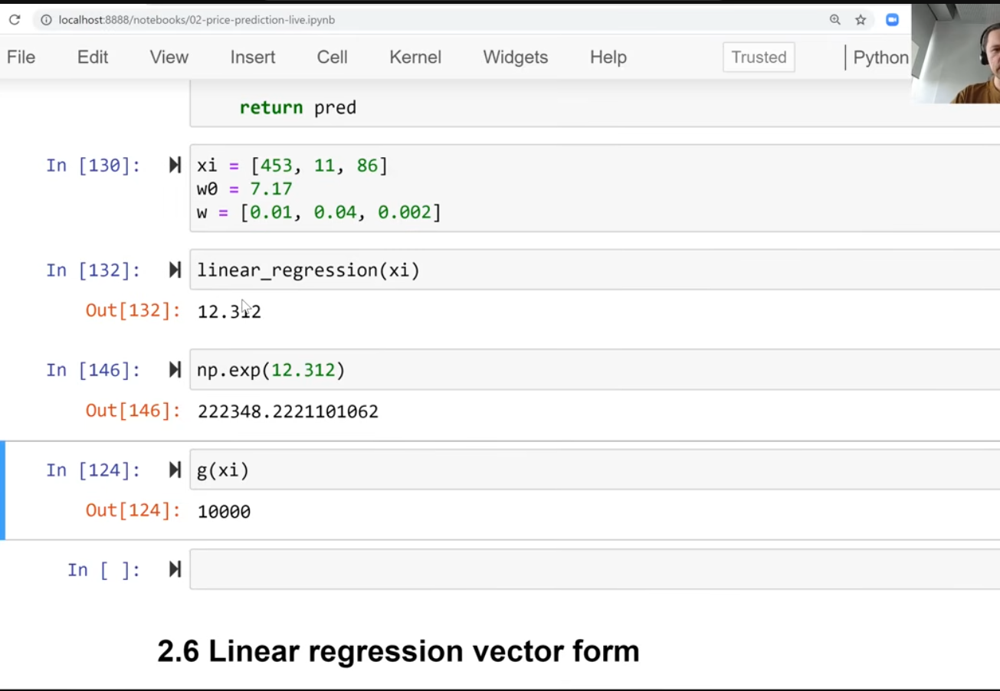
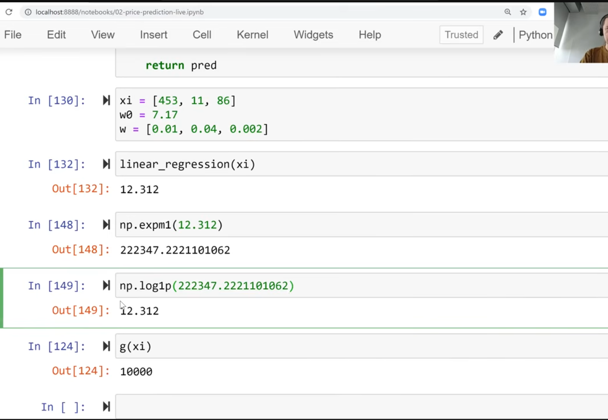

- output of model is a number
-  
- 
- 
- 
- 
- 
- 
- 
- 
- 
- `[hp,mpg,pop.]`
- 
- 
- 
- In mathematics, `np.exp(12.312)` represents the exponential function **\(e^{12.312}\)**, where **\(e\)** is Euler's number (approximately 2.71828).
- 
- 