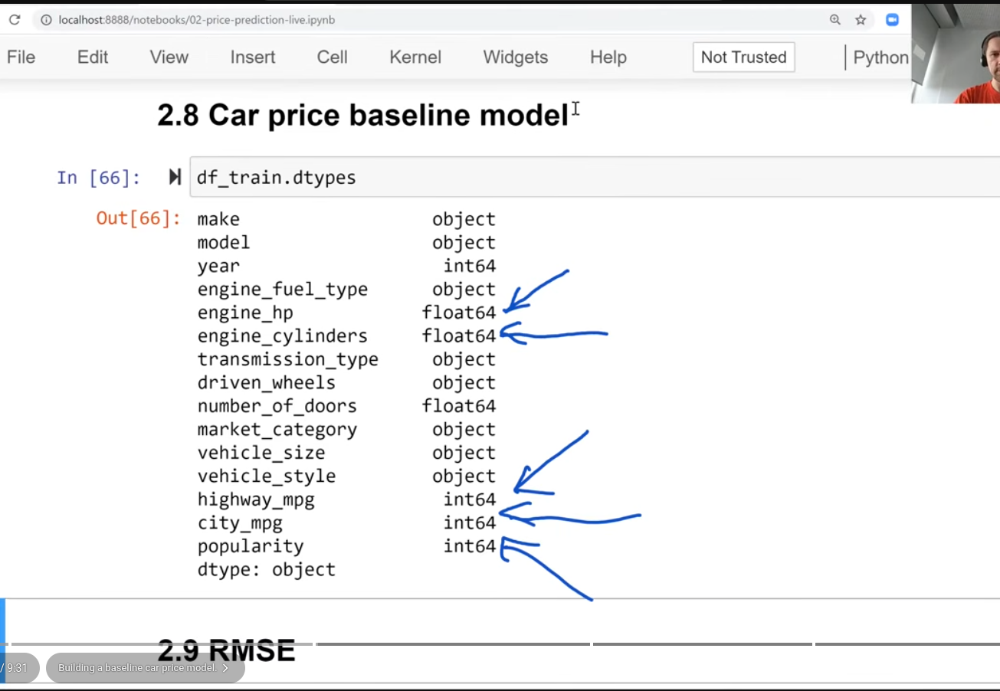 
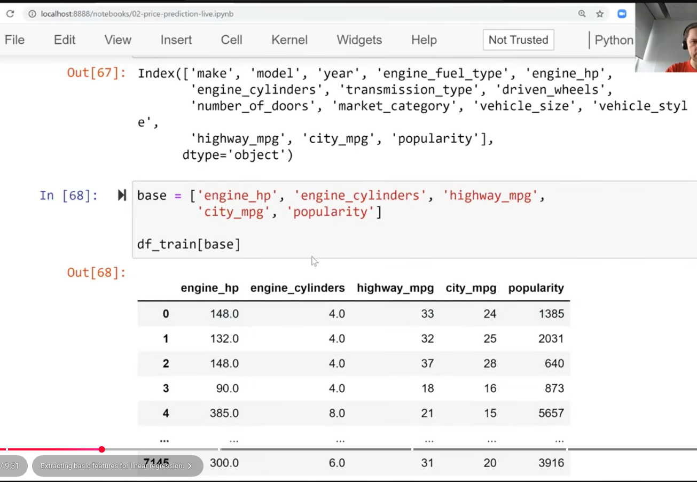 
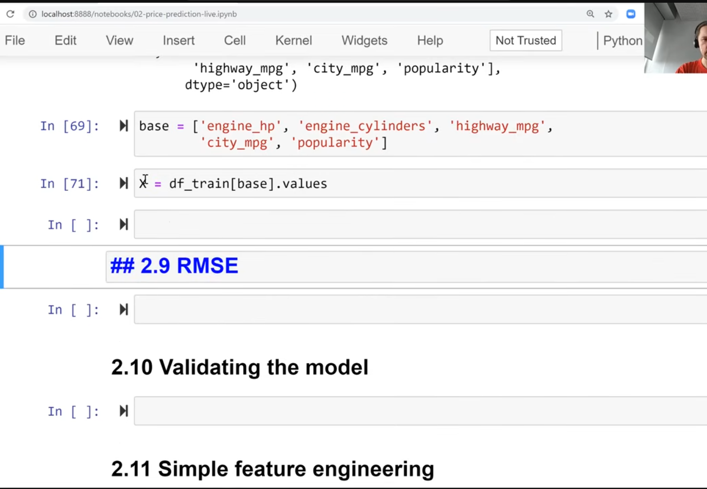 
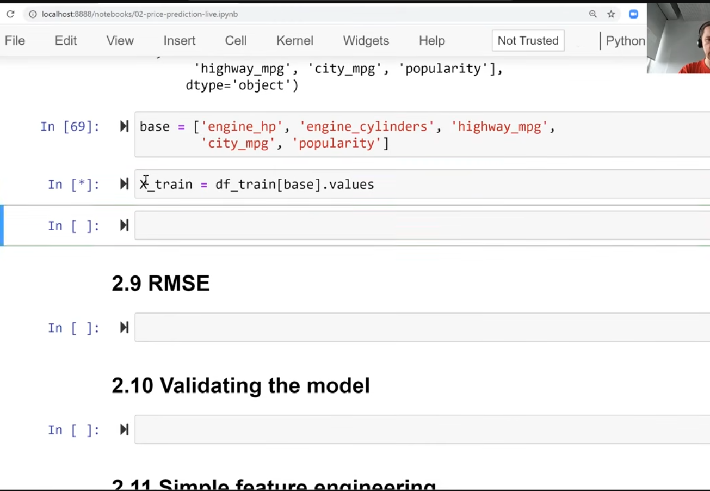 
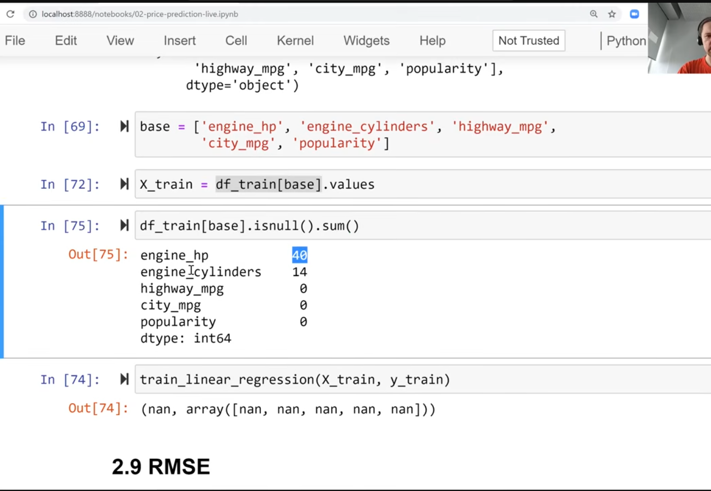 
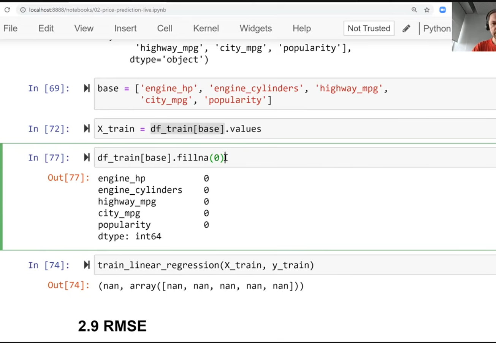 
- fill missing values with 0 to make model ignore features
- 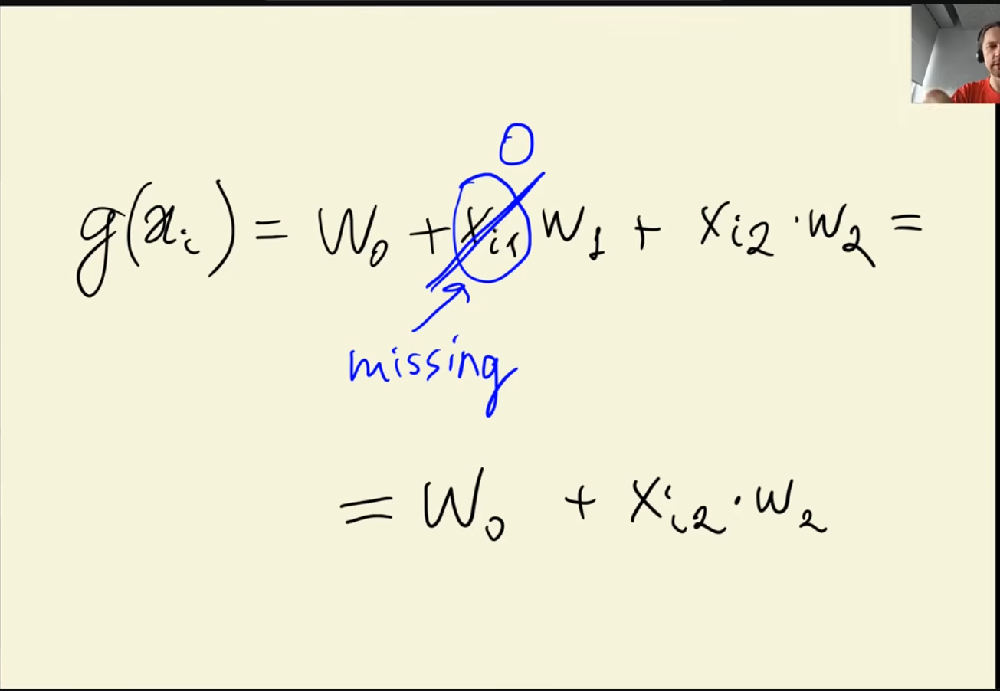
- zero not always best way to deal with missing variables
- 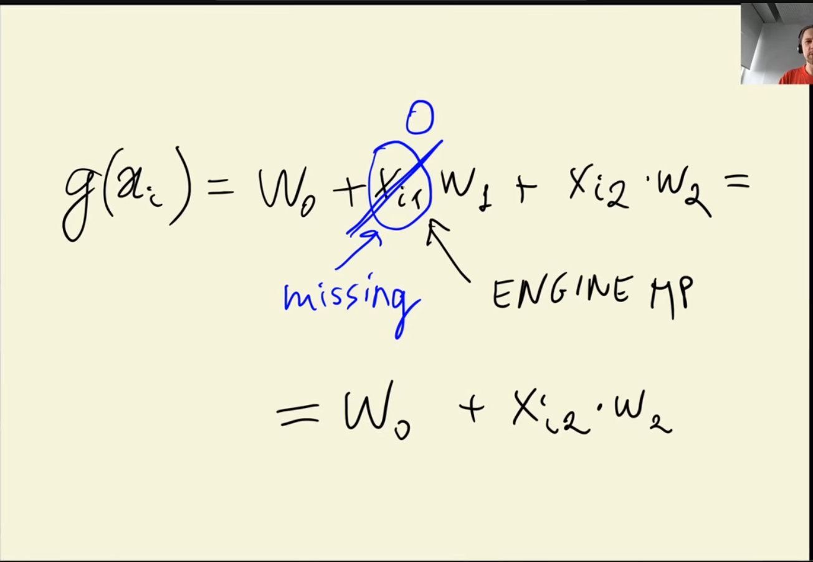
- maybe replacing hp with '0', doesn't make sense, but for machine learning it can sometimes be practical
- 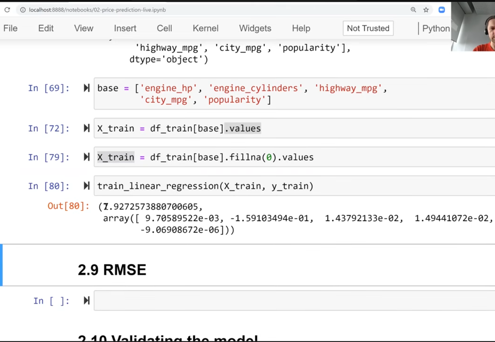
- `y_train `in lesson 2.2

```
import numpy as np

# 1. Split the dataset (60% train, 20% val, 20% test)
n = len(df)
n_val = int(0.2 * n)
n_test = int(0.2 * n)
n_train = n - (n_val + n_test)

# Shuffle indices
idx = np.arange(n)
np.random.seed(2)
np.random.shuffle(idx)

# Create split DataFrames
df_train = df.iloc[idx[:n_train]].copy()
df_val = df.iloc[idx[n_train:n_train+n_val]].copy()
df_test = df.iloc[idx[n_train+n_val:]].copy()

# Reset indices
df_train = df_train.reset_index(drop=True)
df_val = df_val.reset_index(drop=True)
df_test = df_test.reset_index(drop=True)

# 2. Extract and transform the target variable (MSRP/Price)
y_train = np.log1p(df_train.msrp.values)
y_val = np.log1p(df_val.msrp.values)
y_test = np.log1p(df_test.msrp.values)

# 3. Remove target column from features so the model doesn't leak target data
del df_train['msrp']
del df_val['msrp']
del df_test['msrp']
```
- 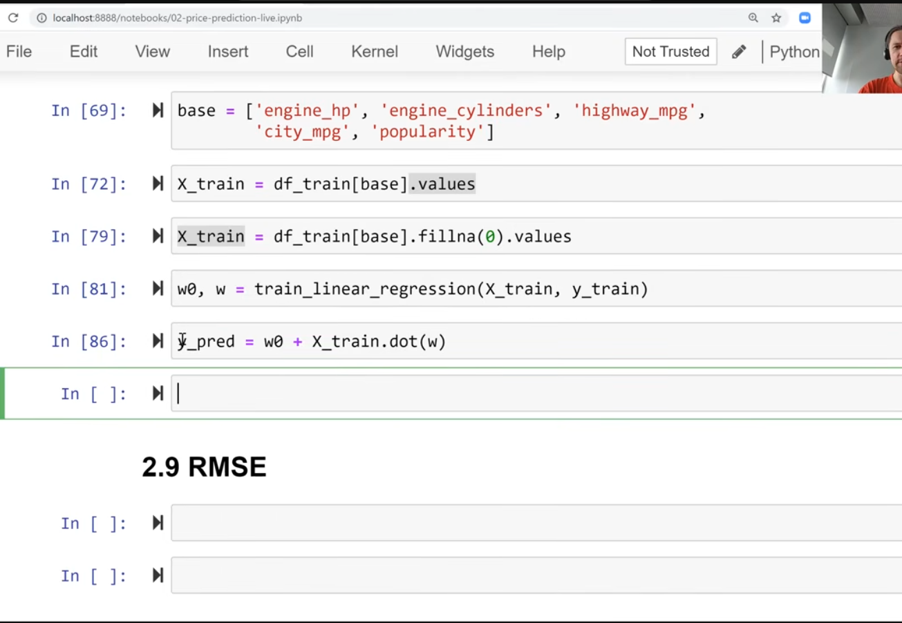
- see if the predictions are similar
- 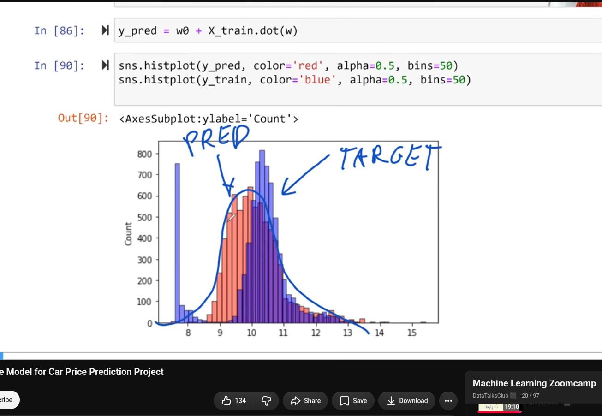
- model not ideal, but need to have objective way to see if model is good
