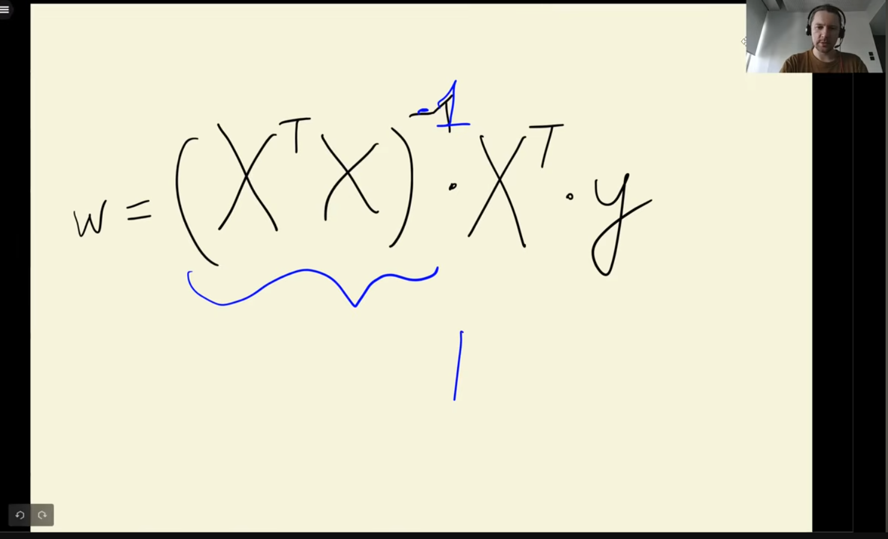
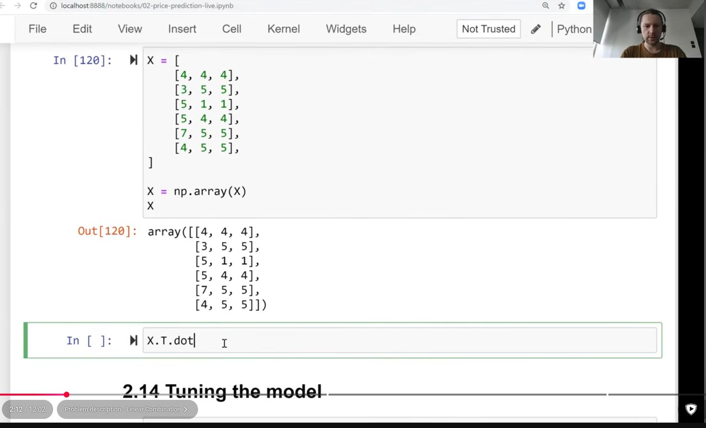
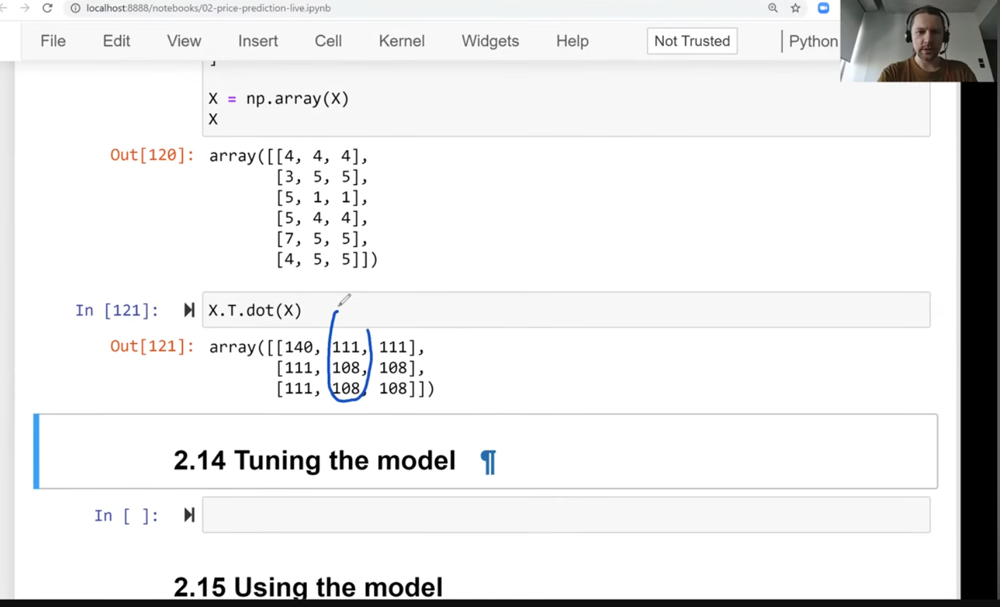
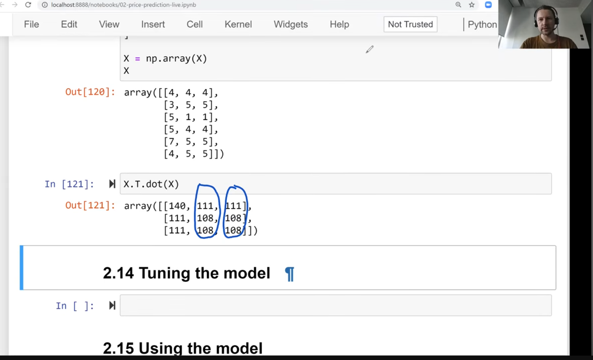
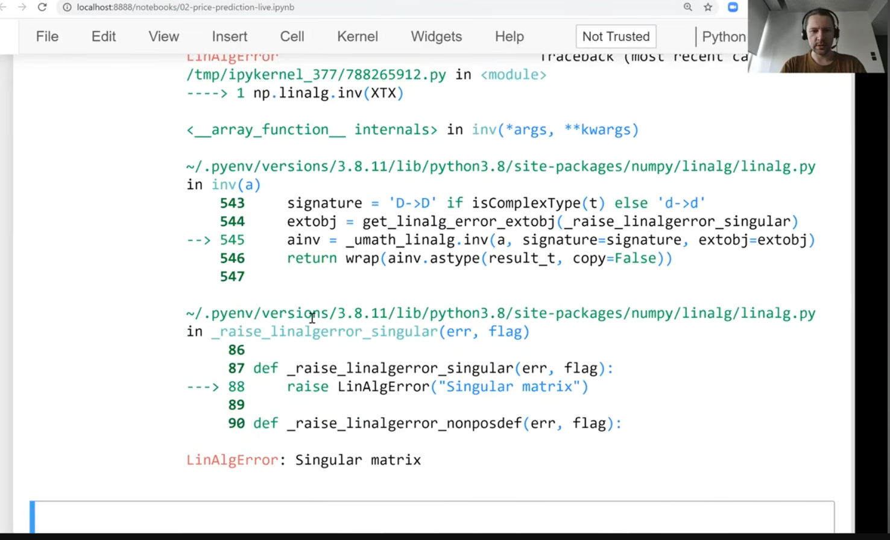
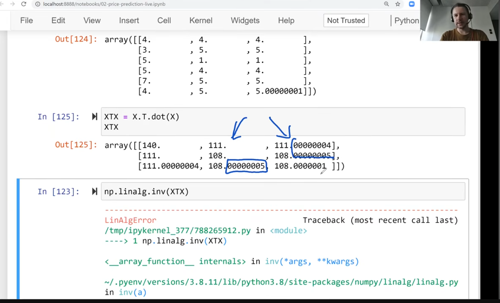
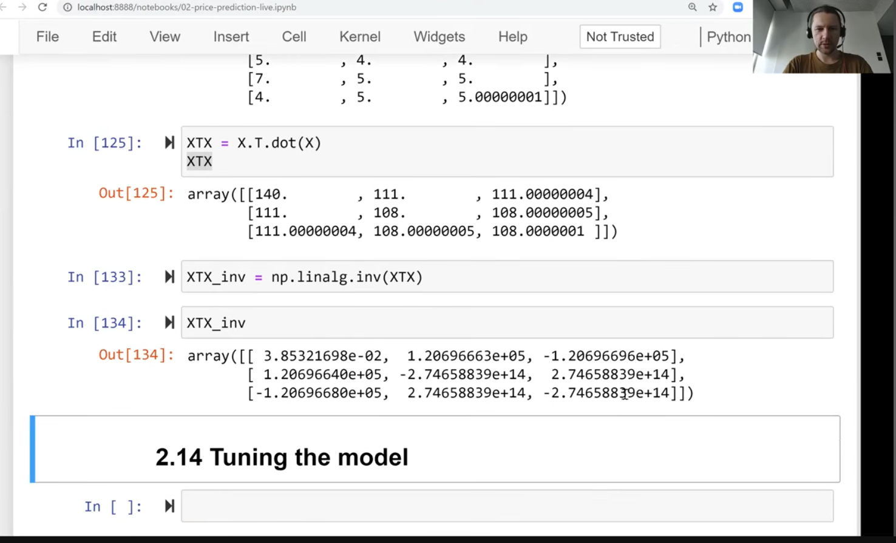
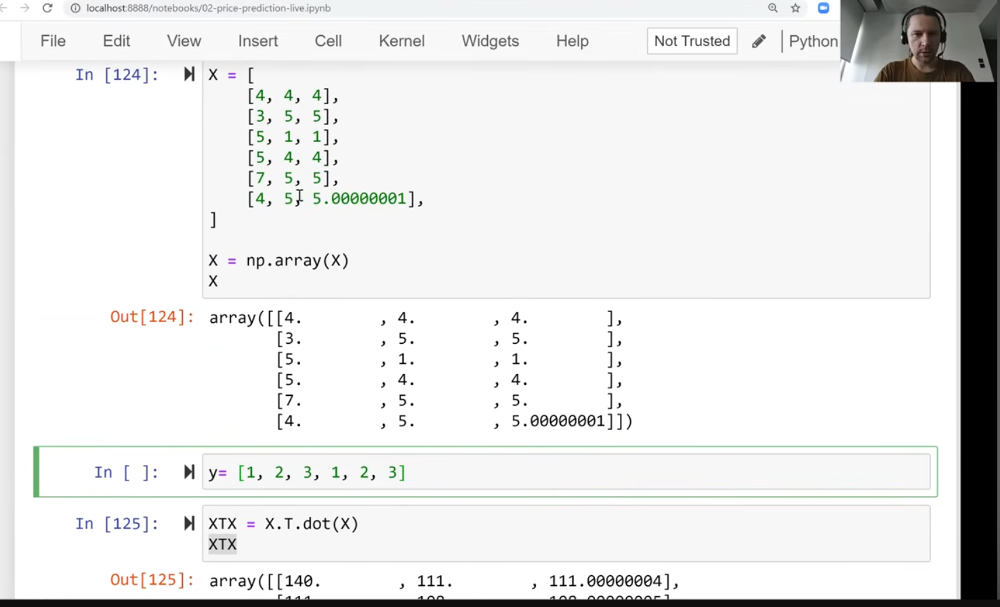
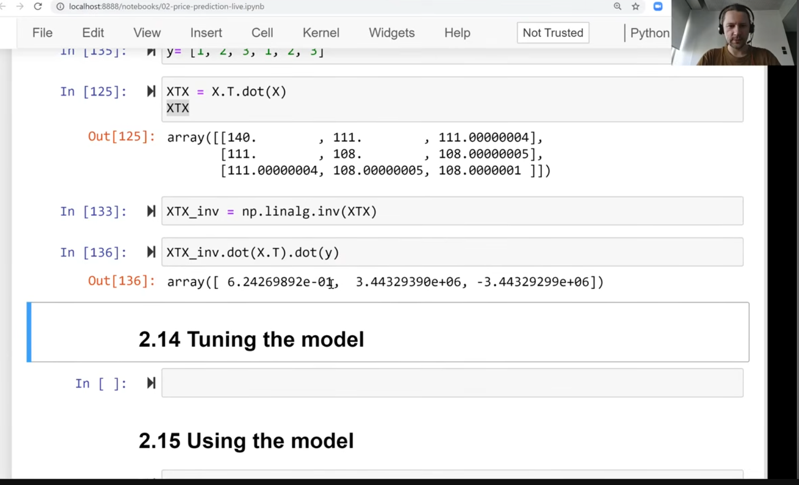

 
- sometimes inverse of Gram matrix doesn't exist
- 
- 
- 
- sometimes inverse doesn't exist
- 
- no errors in this problem
- but adding something slightly different
- 
- so now matrix is invertable
- 
- 
- 
- 