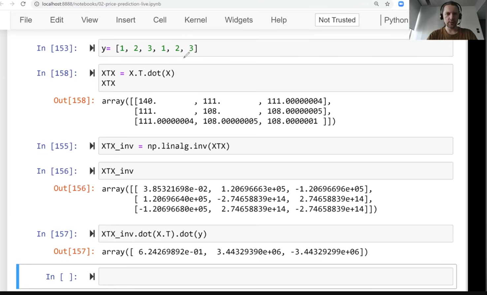
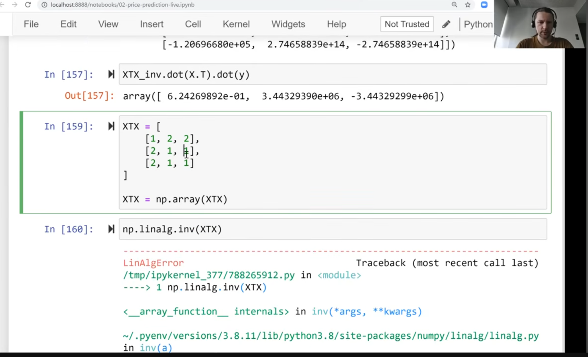
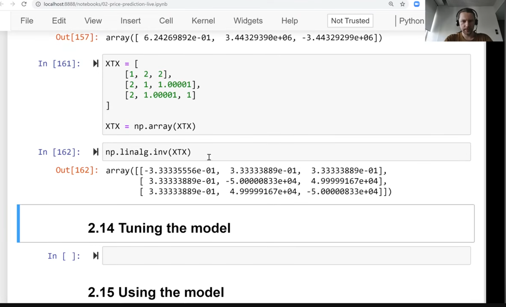
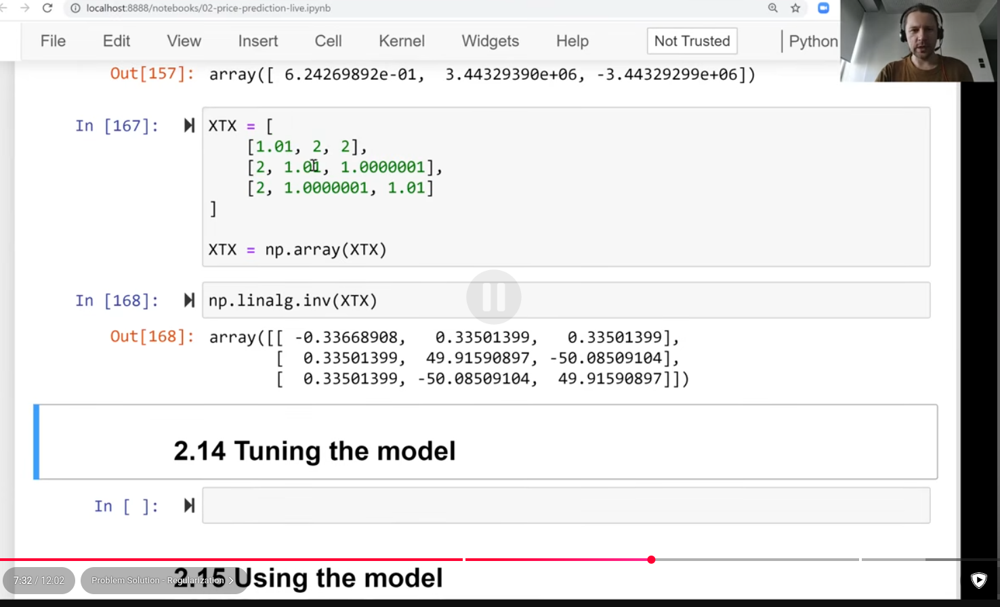
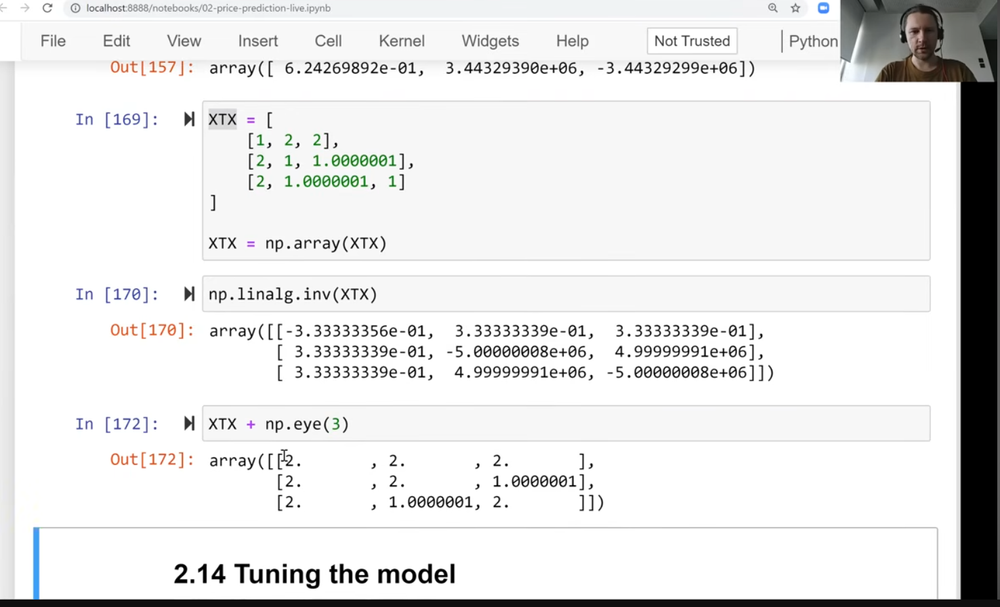
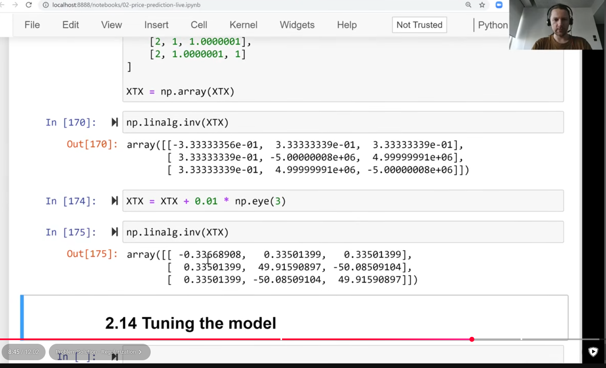
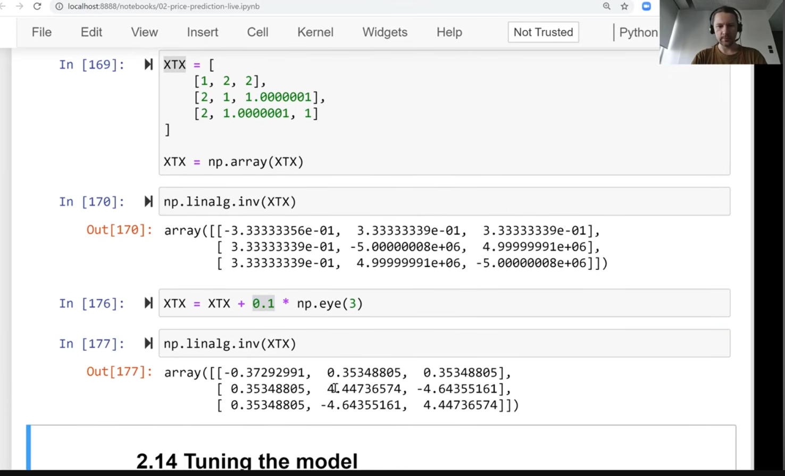
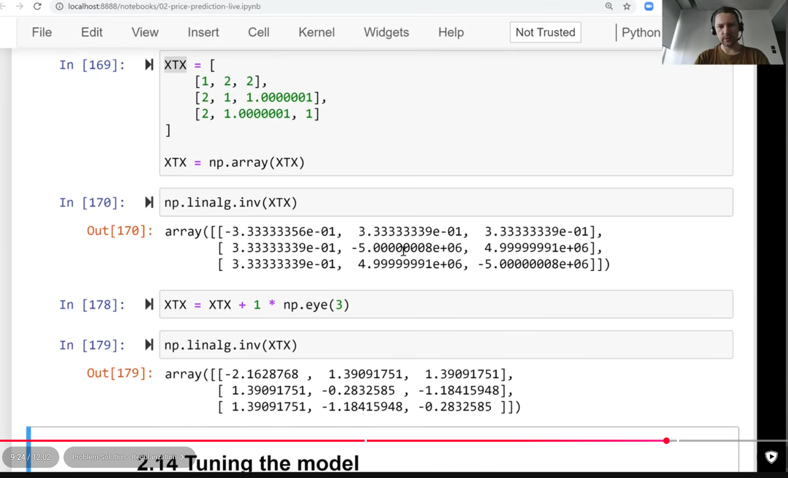
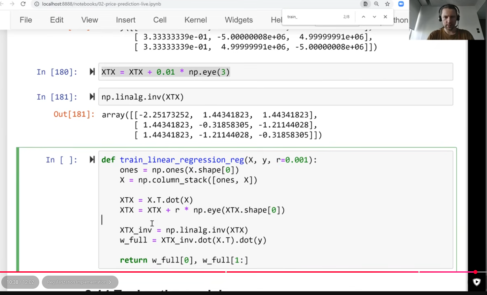
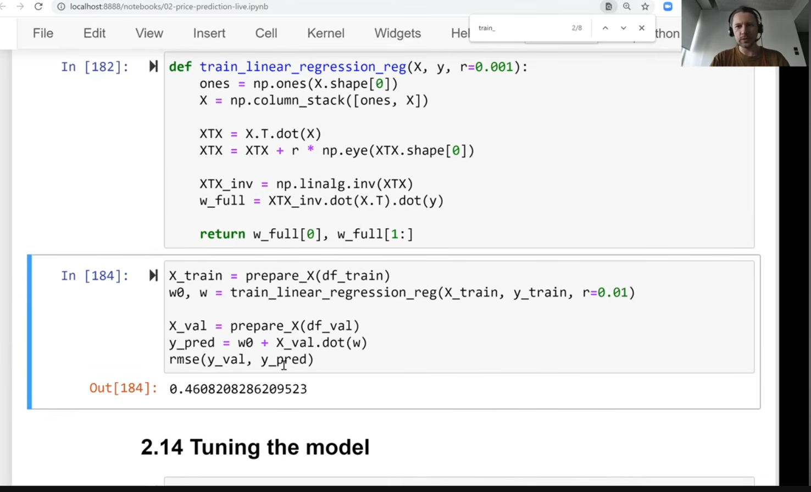

 
- sometimes inverse of Gram matrix doesn't exist
- 
- 
- 
- sometimes inverse doesn't exist
- 
- no errors in this problem
- but adding something slightly different
- 
- so now matrix is invertable
- 
- 
- 
- 
- 
- adding small number
- 
- fix problem by adding small number to diagonal
- 
- adding small number to diagonal makes certain column 3 doesn't duplicate column 2
- 
- 
- this is called _regularization_
- 
- 
- 
- 
- 0.5 improvement!
- 