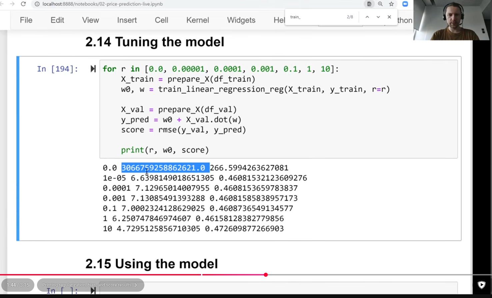

 

In this project (Car Price Prediction), the target variable `y` is transformed using **logarithmic scale** ($\log(price + 1)$).

  

  

  

### How to Interpret the RMSE Score ($\approx 0.4608$)

  

  

1.  **Log Scale Error:** An RMSE of **$0.4608$** means that, on average, the predicted log price deviates from the actual log price by about $0.4608$ units.
    
      
    
2.  **Percentage Error on Actual Price:** Because of the logarithmic transformation ($\ln$), an error $\epsilon$ in log space translates to a relative percentage error on the original scale:
    
      
    

$$\text{Relative Error} \approx e^{\text{RMSE}} - 1$$

$$e^{0.4608} - 1 \approx 1.585 - 1 = 0.585 \text{ or } \mathbf{\approx 58.5\%}$$

3.  **In Dollar Terms:** The predictions are off by roughly a factor of $1.58$ (or approximately $58.5\%$ off from the actual car price in dollars). For example, if a car actually costs **$10,000**, the model's prediction could typically be off by around **$5,850** (predicting around $15,850 or $6,300).
    
      
    

### Immediate Execution Steps:

1.  Inverse-transform the predicted log prices using `np.expm1(y_pred)` to inspect error bounds directly in original dollars.
    
      
    
2.  Calculate the absolute error on untransformed dollar values: `np.abs(np.expm1(y_val) - np.expm1(y_pred)).mean()`.
    
      
    
3.  Evaluate whether to select $r = 0.0001$ or $r = 0.001$ as the optimal regularization parameter based on performance stability across validation splits.