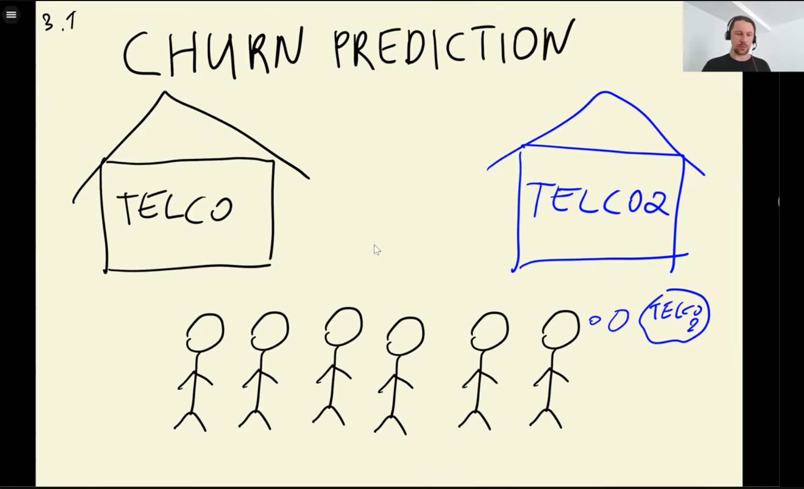
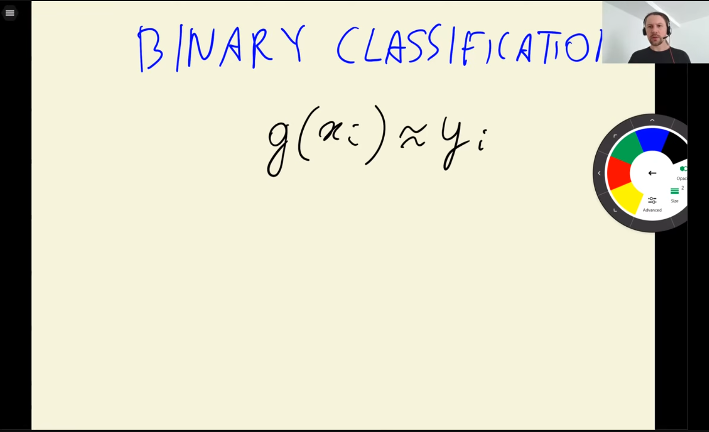
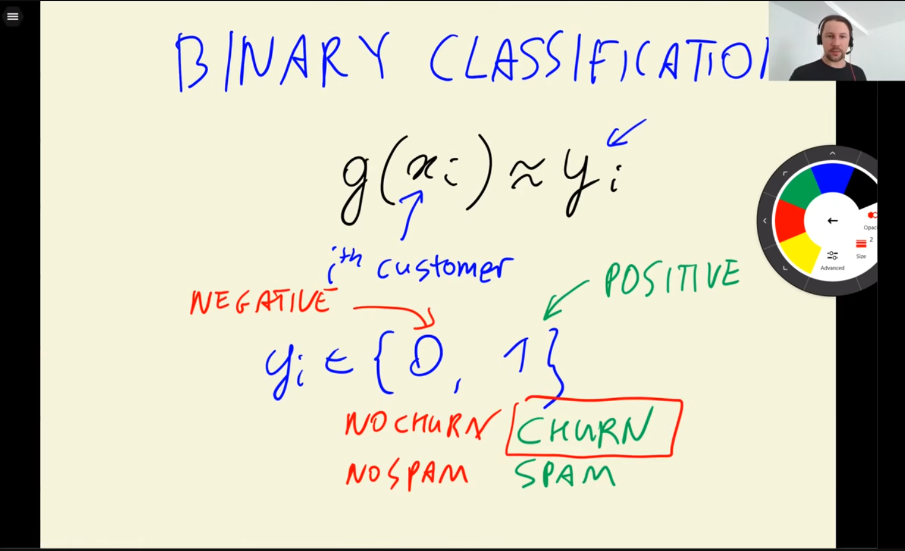
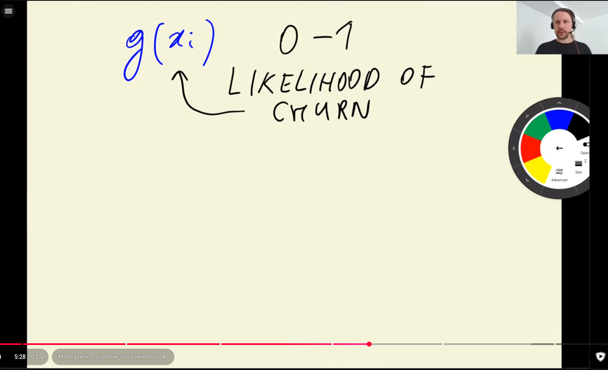
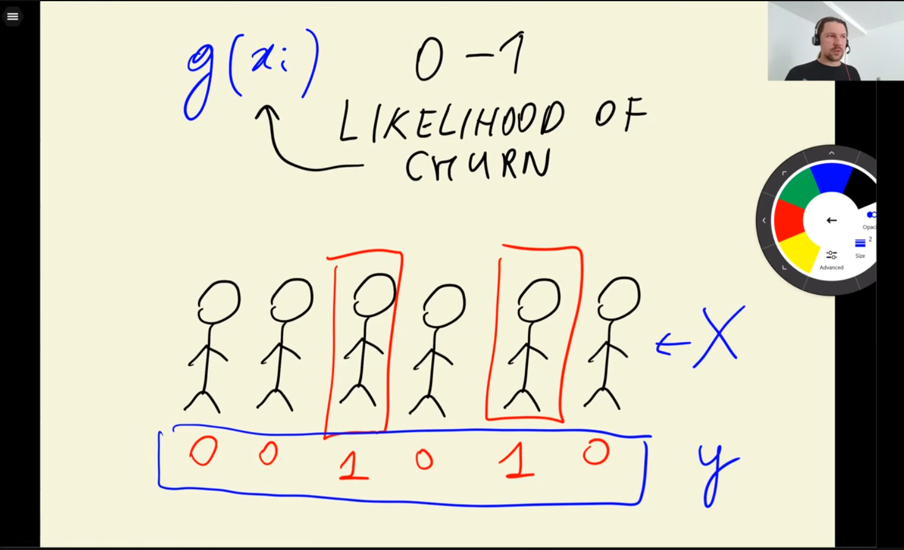
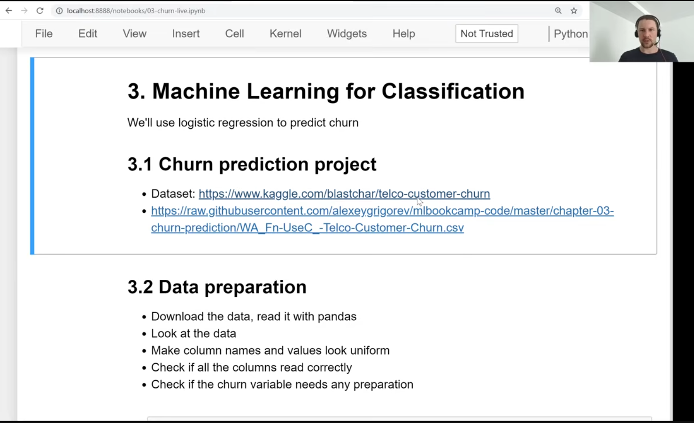
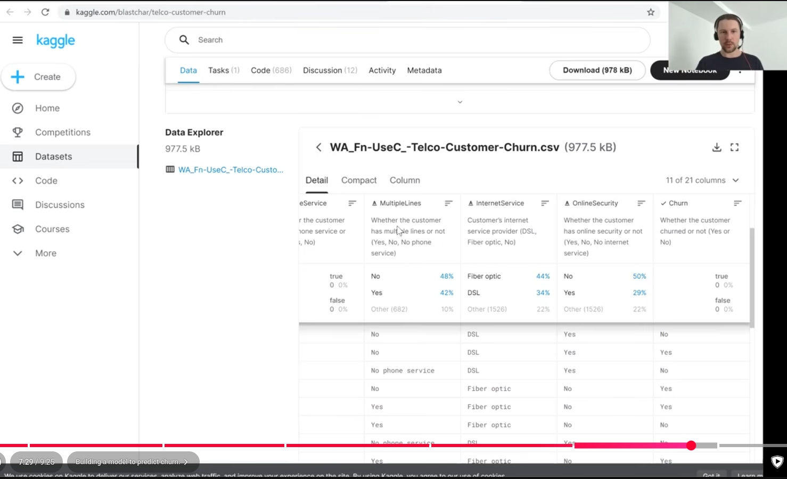

- https://www.youtube.com/watch?v=0Zw04wdeTQo&list=PL3MmuxUbc_hIhxl5Ji8t4O6lPAOpHaCLR
- identify clients that want to leave company
- 
- score likelihood that customer will churn (leave) -- send email or discount if we see likelihood customer will leave
- don't want to offer discounts to someone who is not likely to churn
- 
- 
- 
- 
- 1 = leave
- 0 = stay
- 
- 
- 