https://github.com/DataTalksClub/machine-learning-zoomcamp/blob/main/01-intro/02-ml-vs-rules.md

- Email system
- 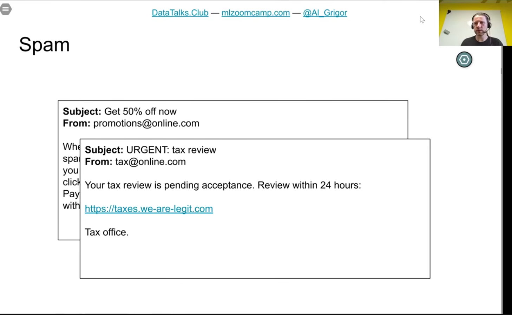
- want to make a spam filter
- 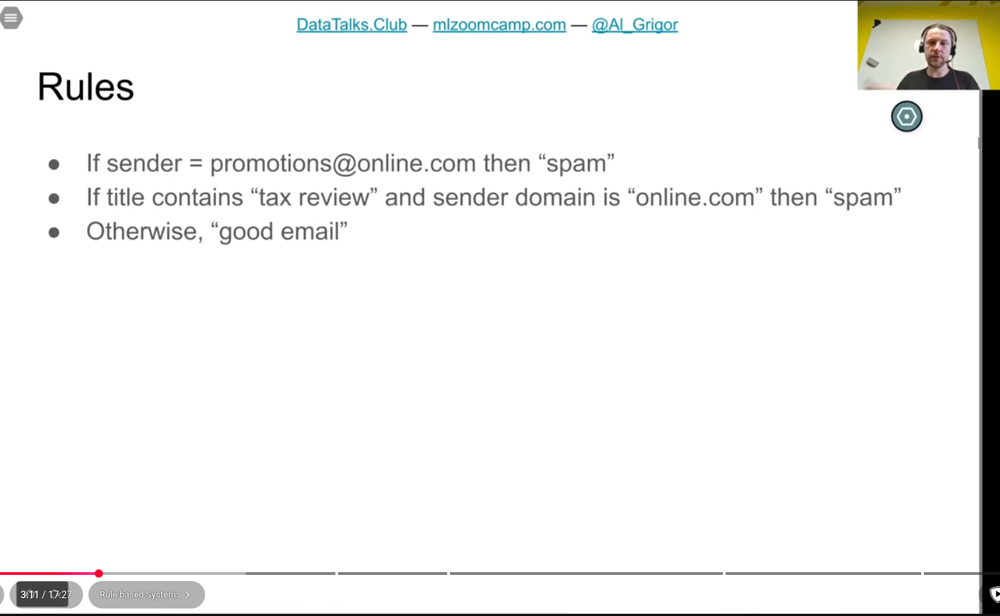
- 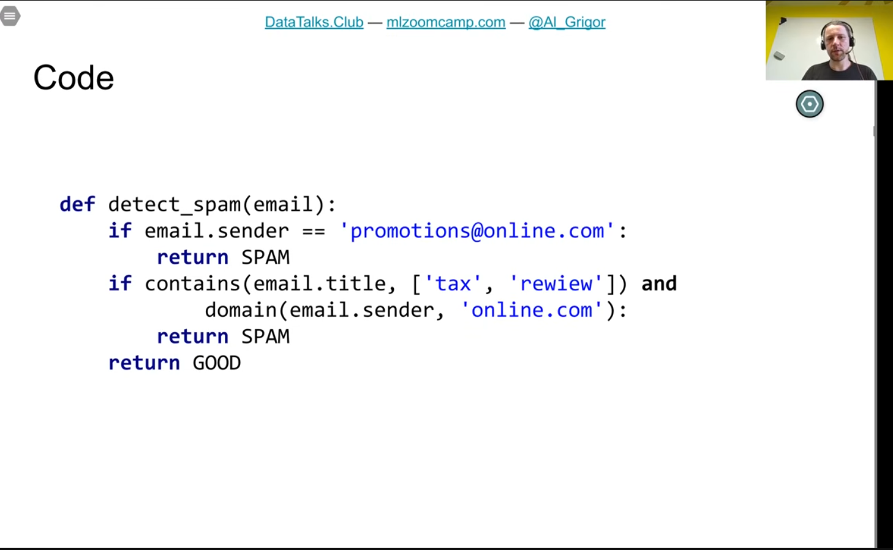
- 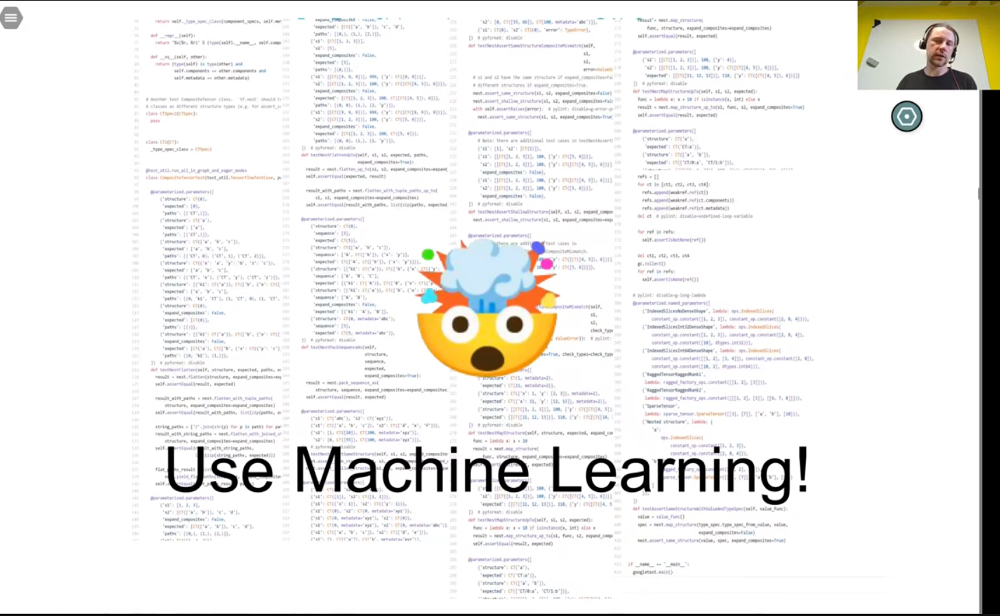
- 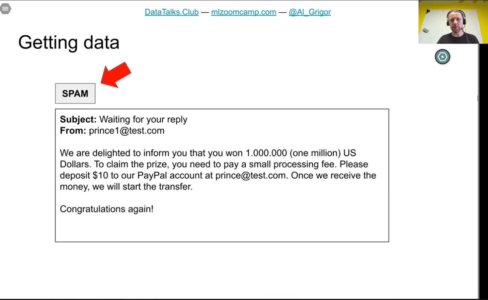
- 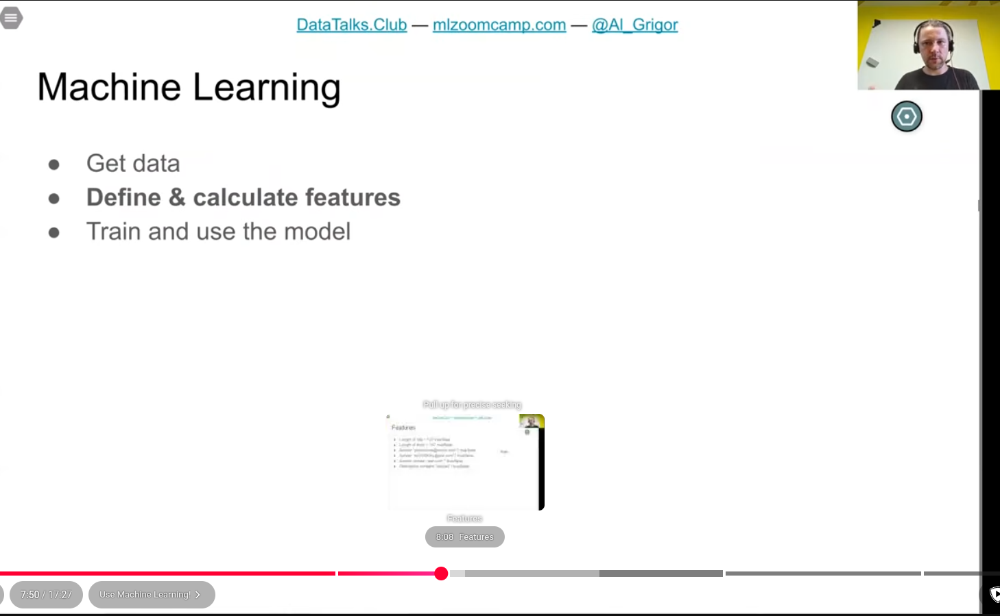
- 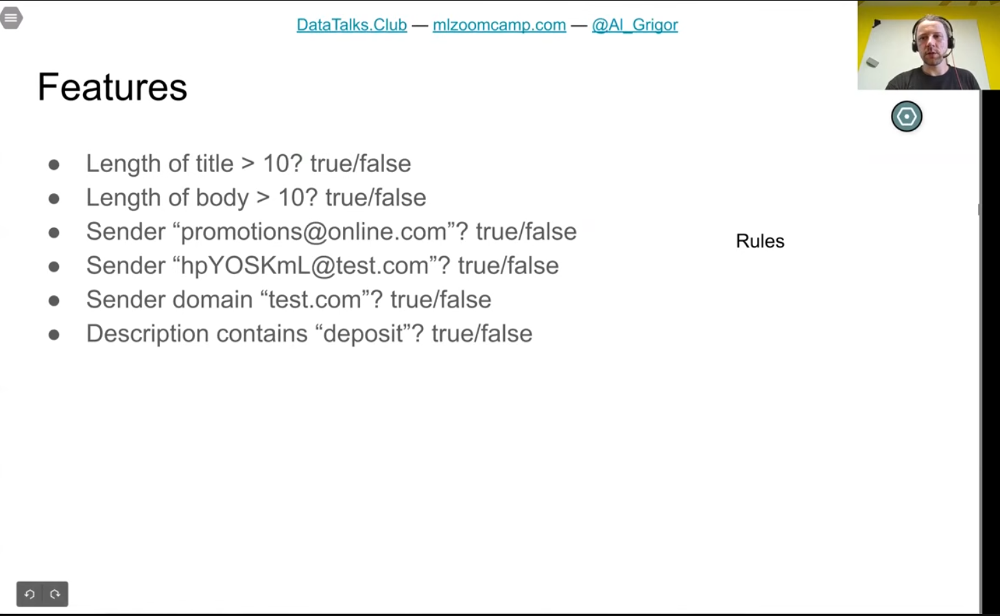
- 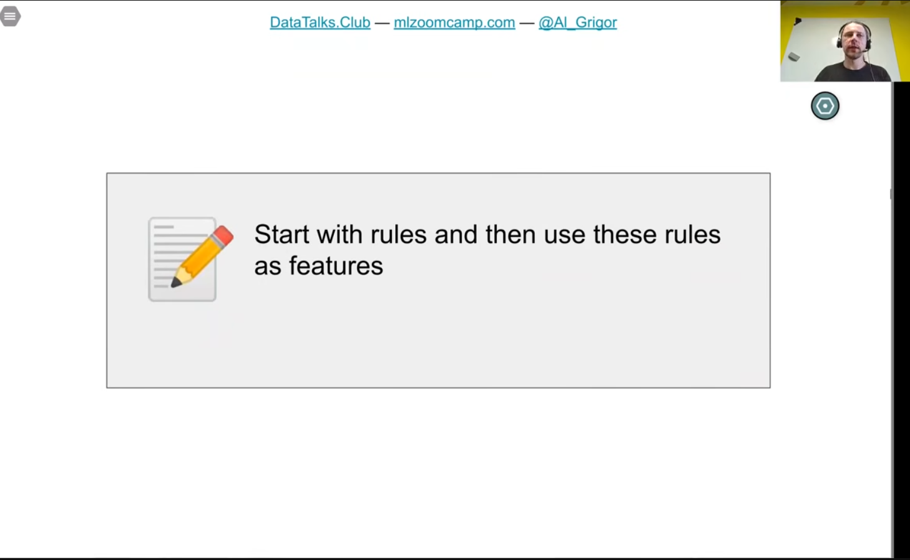
- 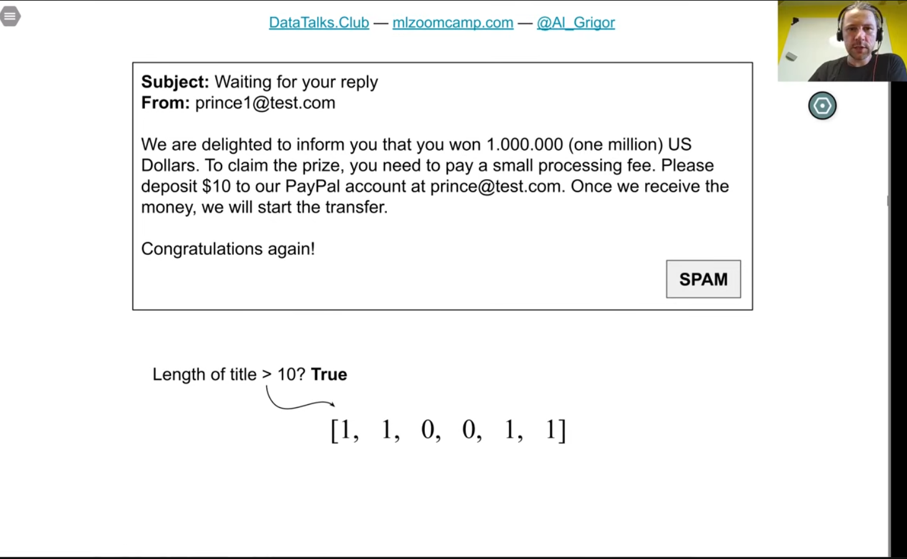
- 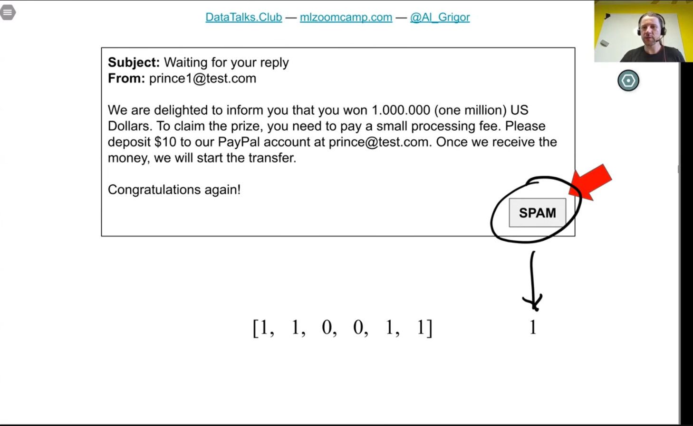
- 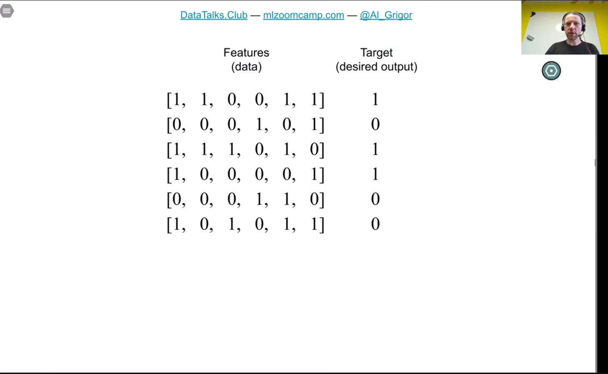
- fitting a model
- 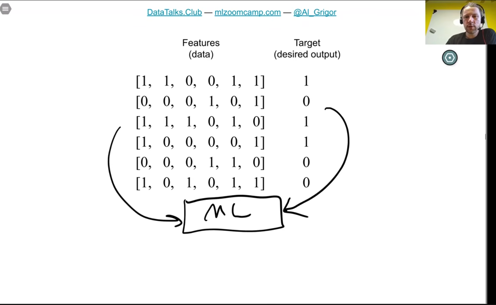
- 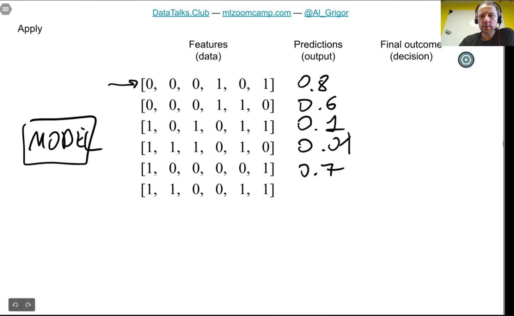
- 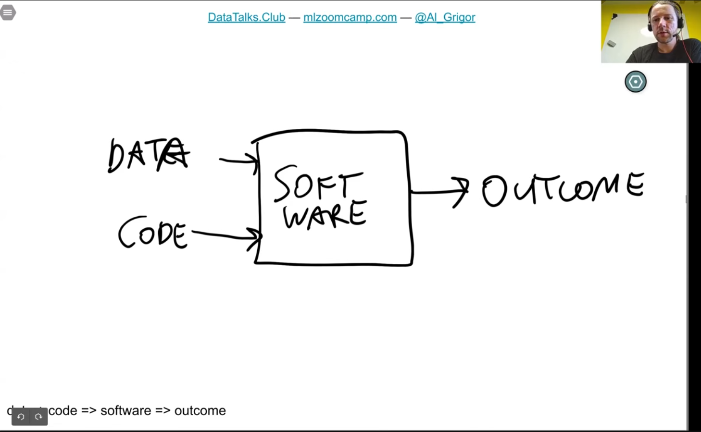
- software system has hard-coded rules
- become difficult to maintain
- that's why machine learning algorithm is better
- 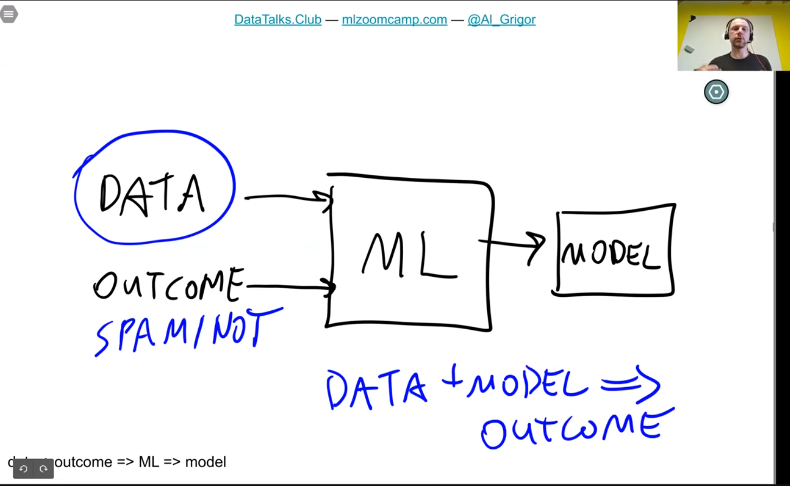