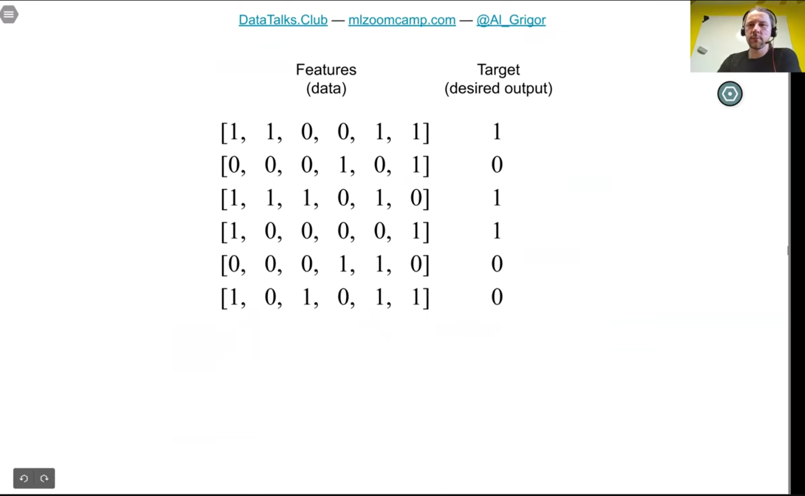
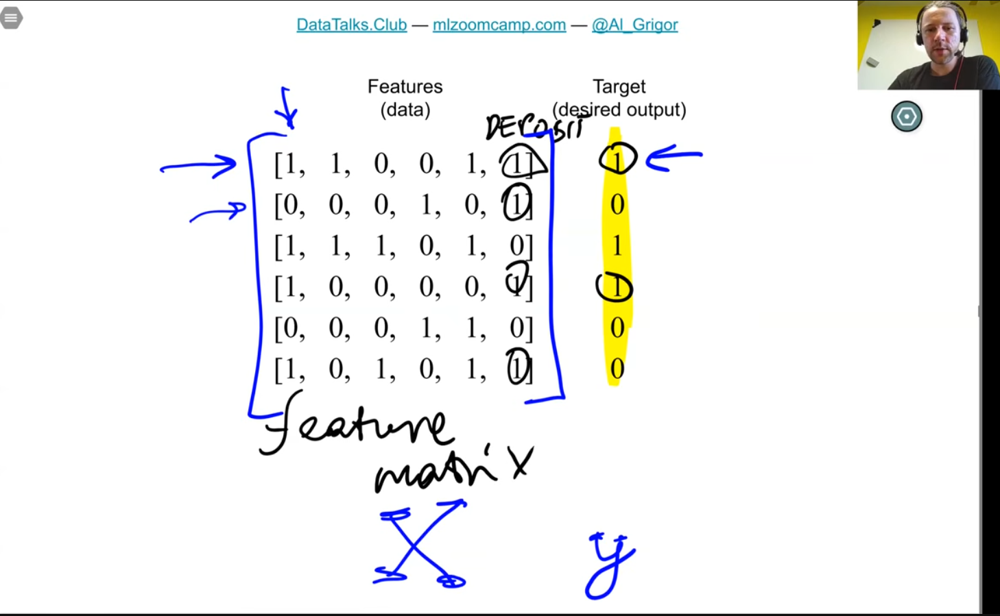
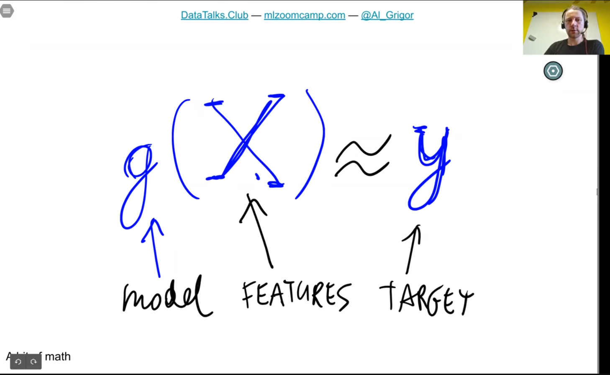
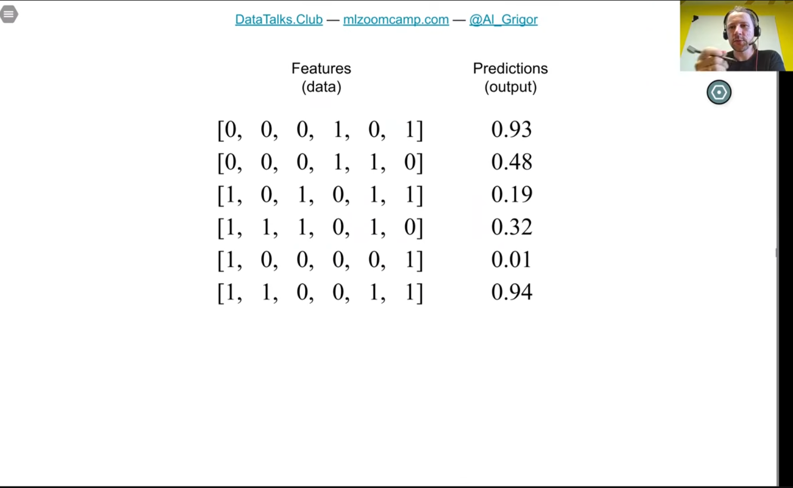
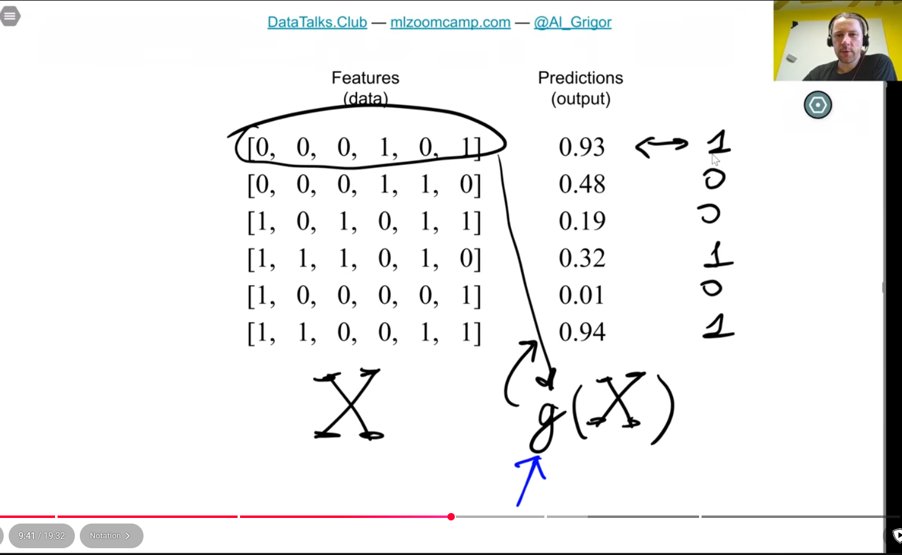
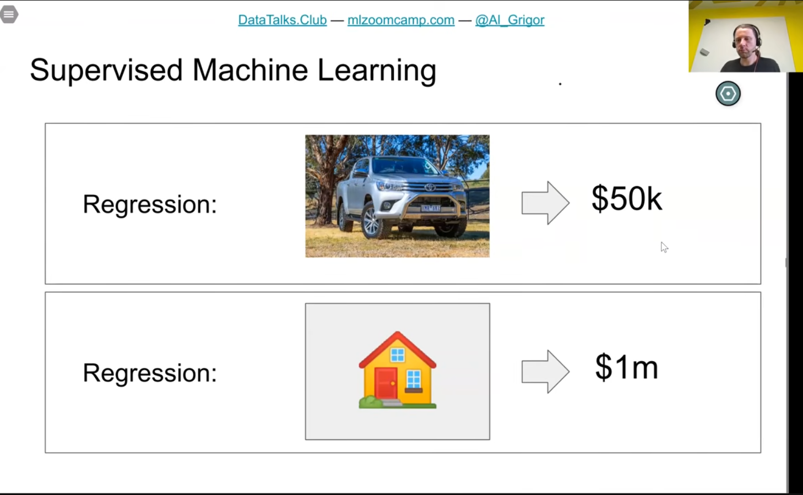
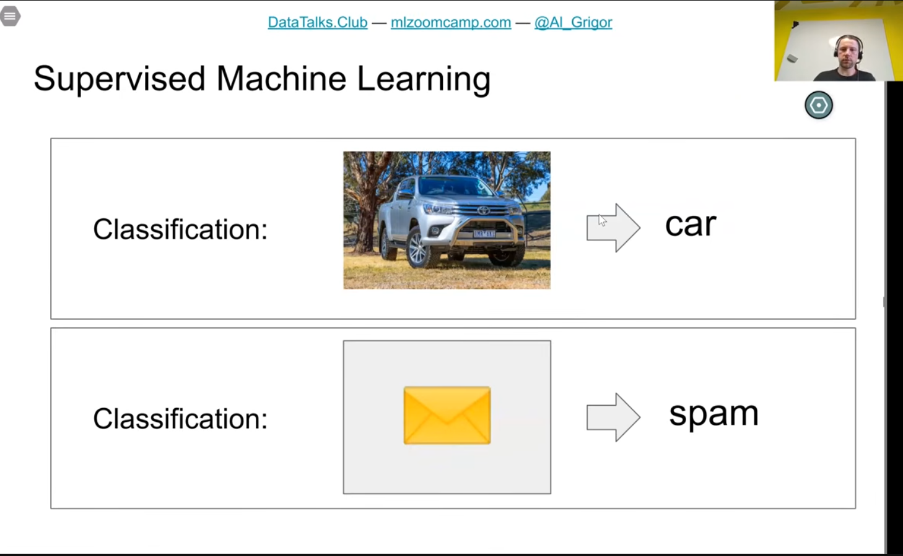
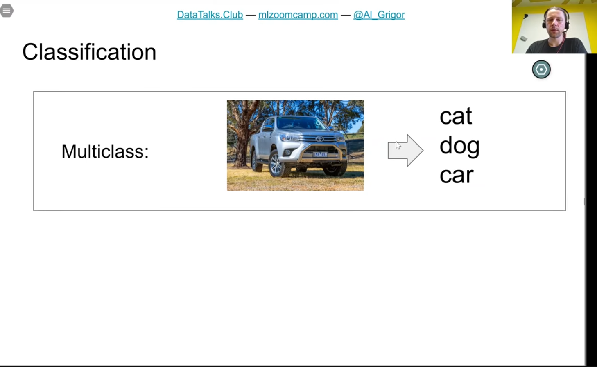
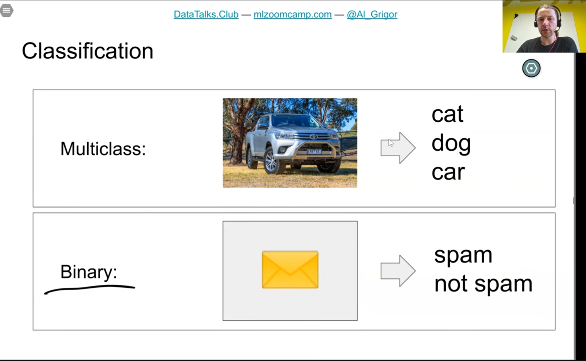
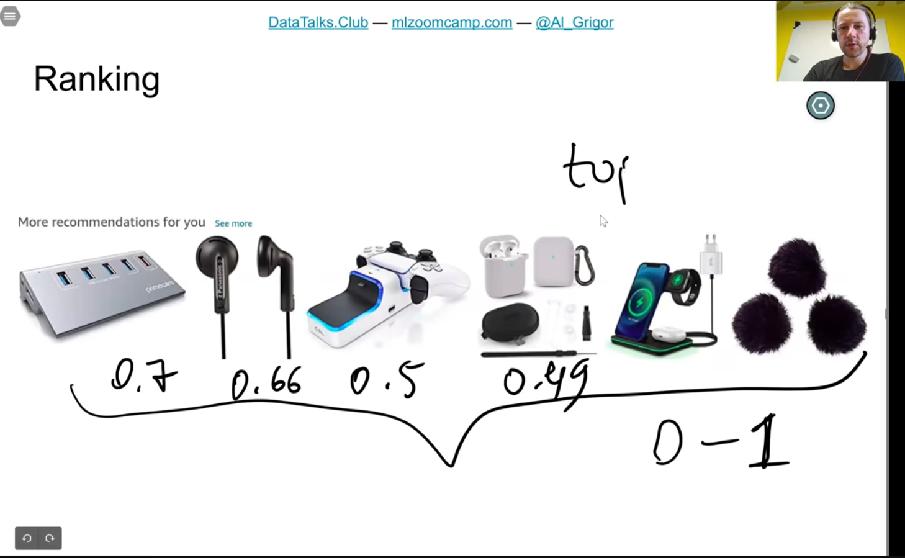

https://github.com/DataTalksClub/machine-learning-zoomcamp/blob/main/01-intro/03-supervised-ml.md

- car price prediction
- spam prediction
- 
- 
- 
  - produce something as close to target variable
  - 
  - 
  - different types of supervised machine learning
  - regression: 
  - classification: 
  - multiclass: 
  - binary classification: 
  - ranking:  
    - score from 0 - 1 --> returns top x item
    - google does something similar for search results