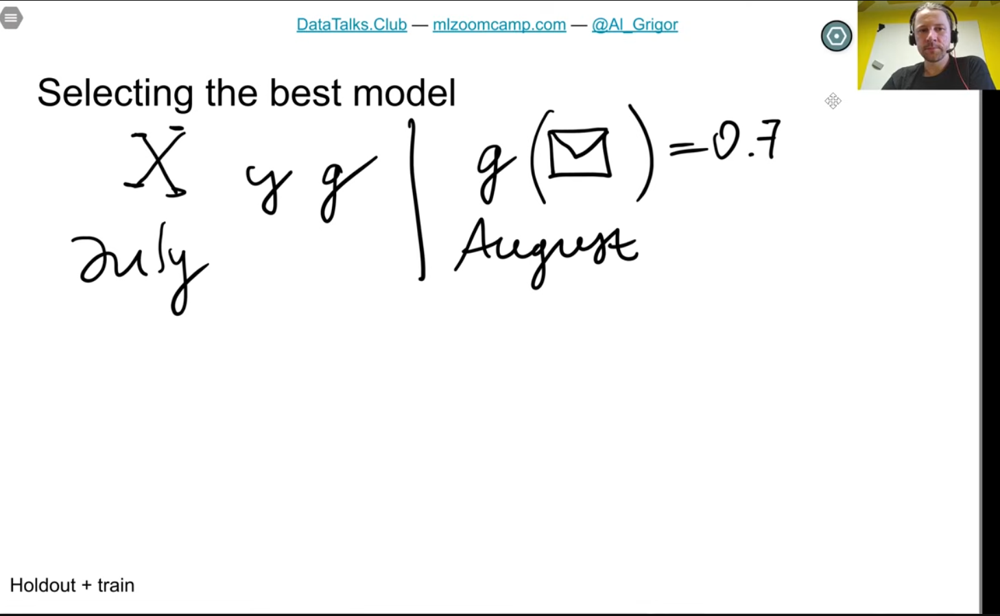
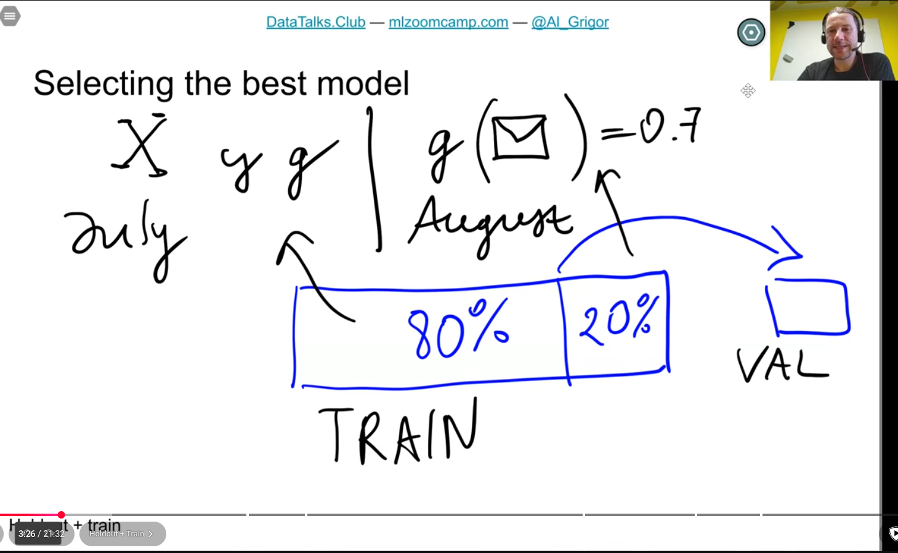
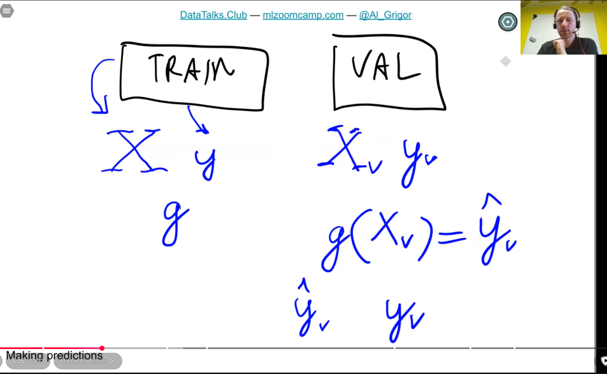
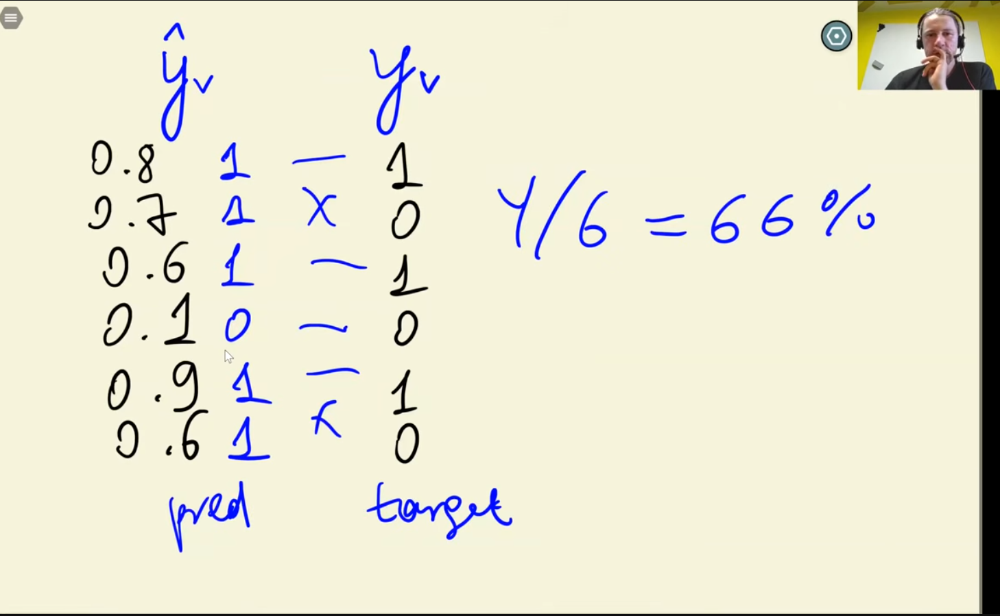
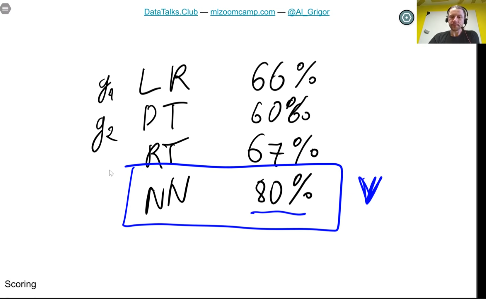
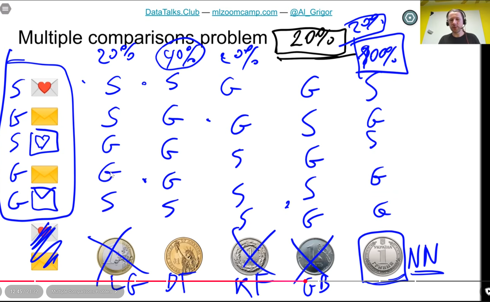
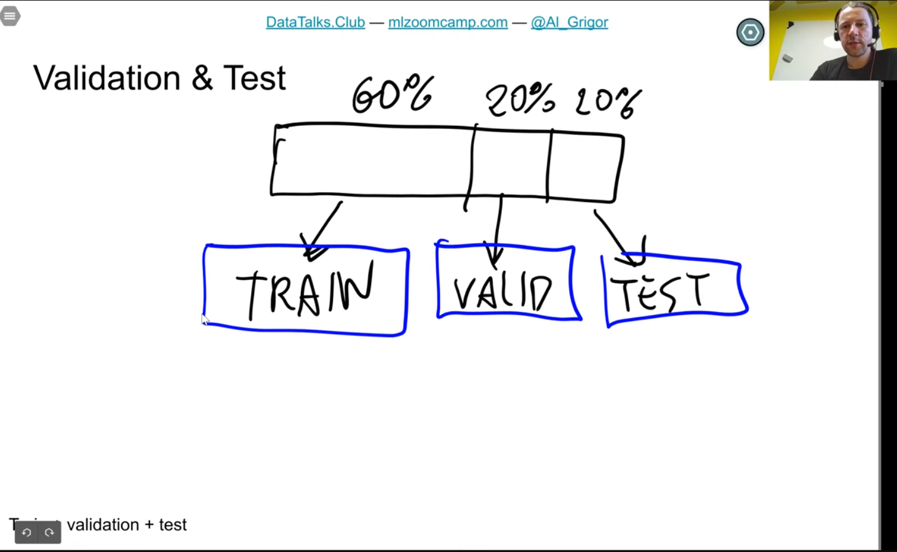

https://github.com/DataTalksClub/machine-learning-zoomcamp/blob/main/01-intro/05-model-selection.md

 

- see how well model performs on data it hasn't seen
- 
- 
- 
- LR = linear regresssion, DT = decision tree, RT = random tree, NN = neural network
- 
- models can sometimes just get lucky
- problem with multiple comparison
- 
- when perform same comparison many times, and eval against same dataset
  - one model just gets lucky and produces better result
  - probablistic
- hold out 2 datasets for validation and testing
-  