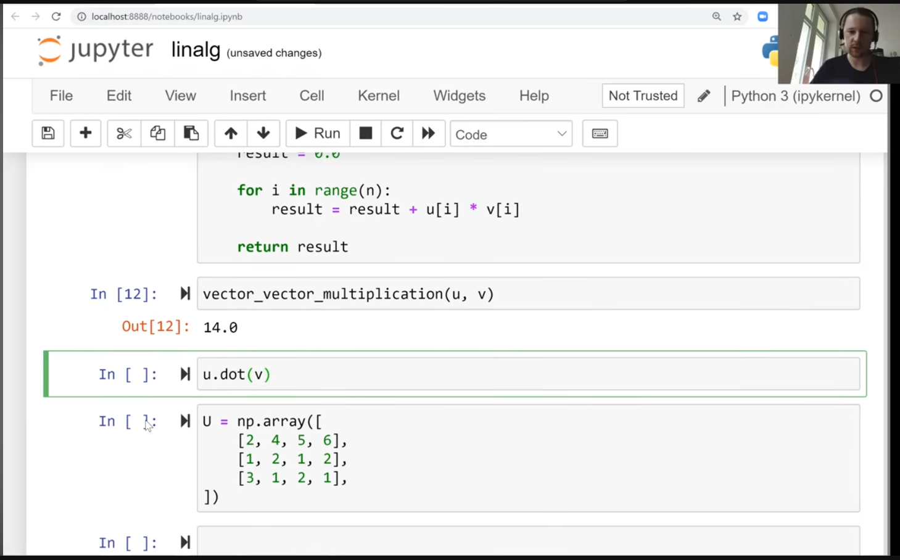
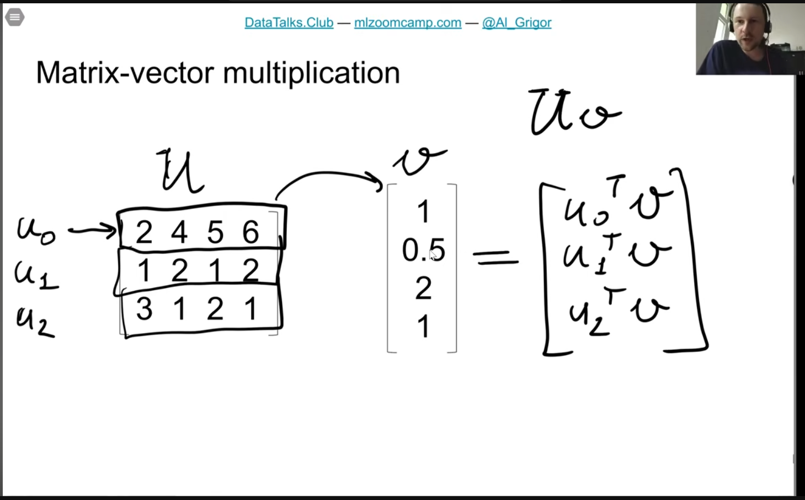
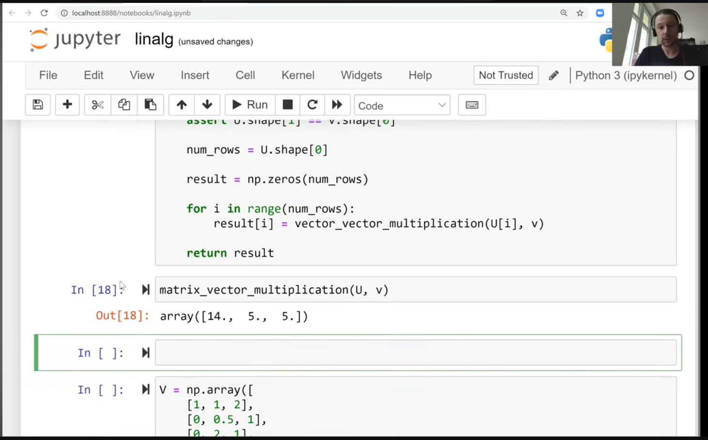

https://www.youtube.com/watch?v=zZyKUeOR4Gg&list=PL3MmuxUbc_hIhxl5Ji8t4O6lPAOpHaCLR&index=10

  

 

- dot product produces a number
- 
- 
- 
-  
- 
- matrix-vector -- you take each row in the matrix and multiply by the other vector
  - basically vector vector multiplication (dot-product)
- 
- 
  - returns a vector with dot product in each row; same number of rows as the matrix
- 
- 
- 